# Are "New" Stats Finally Getting the Respect They Are Due? 
## An analysis of the relationship between awards and the stories told by the numbers, old and new 

Throughout the history of baseball, a few select statistics have dominated discussion of the game amongst fans, media, and players: home runs and batting average on the hitting side, and wins and ERA on the pitching side are perhaps the four strongest examples. But in recent years (though the movement began in the 1970s), *sabermetrics* - "the search for objective knowledge about baseball," as originally defined by Bill James - has garnered a larger share of the public conscience when it comes to measuring performance. More advanced statistics, such as wOBA (weighted on-base average) for hitters and FIP (fielding-independent pitching) for pitchers, are now readily accessible for all curious fans thanks to websites like fangraphs and baseball-reference. And with the increasing popularity of more rigorous approach to analyzing baseball performance - epitomized by the Moneyball story, told in a book by Michael Lewis in 2003 and adapted for the silver screen in 2011 - more and more fans find themselves in the curious camp (while others cling to their *non*-weighted and fielding-*dependent* stats).

I thought it would be interesting to investigate the following question: has the relationship between more advanced statistics and performance in the end-of-year awards (MVP for hitters, Cy Young for pitchers) grown stronger over time, as these stats gained and continue to gain popularity? 

To do this, I decided to use data from the batting, pitching, and awards files. For both batting and pitching, I selected three "old" stats - in both cases, the three Triple Crown stats: AVG, HR, and RBI for batting, and W, K, and ERA for pitching. I then selected three "new" stats for hitting: OBP, SLG, and wOBA; and two for pitching: FIP and K%-BB%. I then calculated two z scores, "zOld" and "zNew", based on a player's performance relative to the league average in each of these statistics. These numbers were then compared to the player's votes received in the year-end awards voting; I looked at the MVP award for hitters and Cy Young award for pitchers. My hypothesis was that the correlation between awards voting and performance in the new statistics would become stronger relative to the correlation between awards voting and performance in the old statistics. 


```python
#read in data
import pandas as pd
import numpy as np

folder = '/Users/chadhorner/Documents/OneDrive/Udacity/P2 baseball data analysis/baseballdatabank-master/core/'

master_file = folder + 'master.csv'
batting_file = folder + 'batting.csv'
pitching_file = folder + 'pitching.csv'
awards_file = folder + 'awardsshareplayers.csv'

master = pd.read_csv(master_file)
batting = pd.read_csv(batting_file)
pitching = pd.read_csv(pitching_file)
awards = pd.read_csv(awards_file)
```

For my data, I decided to use all data from the years 1956 through 2015. The Cy Young data only goes back to 1956, and I like the idea of using the same time frame for both hitters and pitchers. Also, the batting set does not have data on sacrifice flies until until 1955, and this number is necessary to compute both OBP and wOBA, two of the "new" statistics I decided to examine; thus it doesn't make sense to start before that point. 


```python
#can remove unnecessary years that predate awards data
mvp = awards[awards['awardID'] == 'MVP']
cy = awards[awards['awardID'] == 'Cy Young']
```


```python
#have already decided on using 1956+ data, so can just cut out the rest now
mvp = mvp[mvp['yearID'] > 1955]
cy = cy[cy['yearID'] > 1955]
pitching = pitching[pitching['yearID'] > 1955]
batting = batting[batting['yearID'] > 1955]
```


```python
#also can go ahead and cut down to qualified players now:

#only want to look at qualifying hitters/pitchers here, i think. this is sort of a choice, because there
#are many different approaches that could be taken here. i think this is justifiable... the idea is to provide a rough estimate
#and this will do that

batting_games = {}
pitching_games = {}

#create dictionaries that map year to minimum PA/IP needed to qualify
#reference on year info: https://en.wikipedia.org/wiki/Major_League_Baseball_schedule
for year in set(batting['yearID'].append(pitching['yearID'])):
    year = int(year)
    if year < 1961:
        batting_games[year] = 154*3.1
        pitching_games[year] = 154
    elif year == 1972:
        batting_games[year] = 153*3.1
        pitching_games[year] = 153
    elif year == 1981:
        batting_games[year] = 103*3.1
        pitching_games[year] = 103
    elif year == 1994:
        batting_games[year] = 112*3.1
        pitching_games[year] = 112
    elif year == 1995:
        batting_games[year] = 144*3.1
        pitching_games[year] = 144
    else:
        batting_games[year] = 162*3.1
        pitching_games[year] = 162

```


```python
#create new IP and PA fields. need to handle the NAs in the 'SF' field
pitching.loc[:,'IP'] = pitching['IPouts']/3
batting.loc[:,'PA'] = batting['AB'] + batting['HBP'] + batting['BB'] + batting['SH']
batting.loc[:,'PA'] = batting['PA'].add(batting['SF'],fill_value = 0)

#need to add in the requirement fields 'IPreq' and 'PAreq'
def createReq(year,pos):
    if pos == 'batting':
        return batting_games[int(year)]
    elif pos == 'pitching':
        return pitching_games[int(year)]
    else:
        raise ValueError('Please enter either \'batting\' or \'hitting\'')
        
pitching.loc[:,'IPreq'] = pitching['yearID'].apply(createReq,args = ('pitching',))
batting.loc[:,'PAreq'] = batting['yearID'].apply(createReq,args = ('batting',))

#subset data to those players who qualified
batting = batting[batting['PA'] >= batting['PAreq']]
pitching = pitching[pitching['IP'] >= pitching['IPreq']]
```


```python
#create playerYear field in all tables, creating a unique field for each season for each player. this will be 
#used as an index which will be used to merge the tables
def add_playerYear(df):
    df.loc[:,'yearID'] = df['yearID'].apply(str) #cast years to strings
    df.loc[:,'playerYear'] = df['yearID'] + df['playerID'] #combine
    return df

mvp = add_playerYear(mvp)
cy = add_playerYear(cy)
batting = add_playerYear(batting)
pitching = add_playerYear(pitching)

#create pointsPct field, equal to the percentage of the max points that were received
mvp.loc[:,'pointsPct'] = mvp['pointsWon']/mvp['pointsMax']
cy.loc[:,'pointsPct'] = cy['pointsWon']/cy['pointsMax']
```


```python
#merge awards into batting and pitching data
#we can first remove the dupe fields - yearID, lgID, and playerID;
mvp.drop(['awardID', 'yearID', 'lgID', 'playerID'], axis = 1, inplace=True)
cy.drop(['awardID', 'yearID', 'lgID', 'playerID'], axis = 1, inplace=True)
```


```python
#now merging
batting = batting.merge(mvp, how = 'left', on = 'playerYear')
pitching = pitching.merge(cy, how = 'left', on = 'playerYear')


#filling in NAs in 'votesFirst' and 'pointsPct' columns. if the players were not in the awards tables, then
#they obviously had 0 points and 0 first place votes
batting.loc[:,['votesFirst','pointsPct']] = batting.loc[:,['votesFirst','pointsPct']].fillna(value = 0)
pitching.loc[:,['votesFirst','pointsPct']] = pitching.loc[:,['votesFirst','pointsPct']].fillna(value = 0)

```

For pitching, I decided to use two "new" stats: FIP and K% - BB%. FIP is in many ways the golden child of advanced pitching statistics, due to its combo of usefullness and simplicity. I would have liked to include either xFIP or SIERA - both similar to FIP, but with more inputs - as well, but both of these statistics require data (mainly batted-ball data, like ground balls allowed vs. fly balls allowed) that is not in the datasets made available here. K% - BB% is a relatively new stat, and while it is somewhat similar to FIP (K and BB are major components of FIP) it is a bit more straightforward. 

Documentation on FIP is available here: http://www.fangraphs.com/library/pitching/fip/

The data for the 'constants' variable is located here: http://www.fangraphs.com/guts.aspx?type=cn


```python
#calculate FIP, see documentation here: http://www.fangraphs.com/library/pitching/fip/
#FIP = [(13 * HR) + (3*[BB + HBP]) - 2 * K]/IP + FIP constant

#read in data on constants (will need this later for wOBA as well)
constants = pd.read_csv(folder + 'fangraphs leaderboard.csv',index_col = 0)

#cut out IPouts = 0 to avoid div/0 error
pitching = pitching[pitching['IPouts'] > 0]

#this function is no longer used - rewrote without for loop
def calcFIP(data, const):
    FIPs = []
    FIP = 0
    for index, entry in data.iterrows():
        FIP = ((13 * entry['HR']) + (3 * (entry['BB'] + entry['HBP'])) - (2 * entry['SO']))/(entry['IPouts']/3)
        FIP += const.loc[int(entry['yearID']),'cFIP']
        FIPs.append(FIP)
    return pd.Series(FIPs, index = data.index)

def getFIPconstant(year):
    return constants.loc[int(year),'cFIP']

pitching.loc[:,'FIP'] = ((13 * pitching['HR']) + (3 * (pitching['BB'] + pitching['HBP'])) - (2 * pitching['SO']))/(pitching['IPouts']/3)
pitching.loc[:,'FIP'] += pitching.loc[:,'yearID'].apply(getFIPconstant)

```


```python
#calcuate K% - BB%
#KBB = (K - BB)/batters faced

#this function is no longer used - rewrote without for loop
def calcKminusBB(data):
    KBBs = []
    KBB = 0
    for index, entry in data.iterrows():
        K = entry['SO']/entry['BFP']
        BB = entry['BB']/entry['BFP']
        KBB = K - BB
        KBBs.append(KBB)
    return pd.Series(KBBs, index = data.index)

pitching.loc[:,'KBB'] = (pitching['SO'] - pitching['BB'])/pitching['BFP']
```

For batting, I decided to use three "new" stats: OBP, SLG, and wOBA. OBP and SLG (on-base percentage and slugging percentage, respectively) are relatively mainstream at this point, but historically have often been overlooked in favor of the simpler batting average (AVG in my code). OBP credits players for taking walks, whereas AVG overlooks that (this is arguably one of the main lessons of Moneyball!). SLG gives players more credit for extra base hits - it is a measurement of total bases per at bat, whereas AVG is simply hits per at bat. 

wOBA stands for weighted on-base average, and assigns different weights to the various outcomes of a plate appearance (hits, walks, hit by pitch, etc.) that aren't equivalent to simply the number of bases resulting from that outcome. i.e., from the FanGraphs write-up on wOBA, "Is a double worth twice as much as a single? In short, no." This is far less mainstream than even OBP and SLG, but is arguably the most "complete" way to evaluate the performance of a hitter. 

Documentation on wOBA is available here: http://www.fangraphs.com/library/offense/woba/

Documentation on other hitting statistics is available here: http://www.fangraphs.com/library/offense/offensive-statistics-list/


```python
#calculate AVG (which is not in the dataset), OBP and SLG

#cut out ABs = 0 to avoid div/0 error
batting = batting[batting['AB'] > 0]

#these functions are no longer used - the code has been rewritten without for loops

#AVG is simply hits per at-bat
def calcAVG(data):
    AVGs = []
    AVG = 0
    for index, entry in data.iterrows():
        AVG = entry['H'] / entry['AB']
        AVGs.append(AVG)
    return pd.Series(AVGs, index = data.index)

#OBP is the % of plate appearances that result in getting on base
def calcOBP(data):
    OBPs = []
    OBP = 0
    for index, entry in data.iterrows():
        if np.isnan(entry['SF']): #if we don't have SF (which doesn't appear earlier in the dataset) we can't calc OBP
            OBP = np.nan
        else:
            OBP = (entry['H'] + entry['BB'] + entry['HBP']) / (entry['AB'] + entry['BB'] + entry['HBP'] + entry['SF'])
        OBPs.append(OBP)
    return pd.Series(OBPs, index = data.index)

#SLG is the number of total bases per at-bat
def calcSLG(data):
    SLGs = []
    SLG = 0
    for index, entry in data.iterrows():
        SLG = (entry['H'] + entry['2B'] + (2 * entry['3B']) + (3 * entry['HR'])) / entry['AB']
        SLGs.append(SLG)
    return pd.Series(SLGs, index = data.index)

batting.loc[:,'AVG'] = batting['H']/batting['AB']
batting.loc[:,'OBP'] = (batting['H'] + batting['BB'] + batting['HBP']) / (batting['AB'] + batting['BB'] + batting['HBP'] + batting['SF'])
batting.loc[:,'SLG'] = (batting['H'] + batting['2B'] + 2*batting['3B'] + 3*batting['HR'])/batting['AB']
```


```python
#calculate wOBA. see formula here: http://www.fangraphs.com/library/offense/woba/

#this function is no longer used - has been rewritten without for loops
def calcwOBA(data, constants):
    wOBAs = []
    wOBA = 0
    for index, entry in data.iterrows():
        if np.isnan(entry['SF']): #if we don't have SF (which doesn't appear earlier in the dataset) we can't calc wOBA
            wOBA= np.nan
        else:
            const = constants.loc[int(entry['yearID'])]
            cBB, cHBP, c1B, c2B, c3B, cHR = const['wBB'],const['wHBP'],const['w1B'],const['w2B'],const['w3B'],const['wHR']
            netBB, HBP, double, triple, HR, SF, AB = entry['BB'] - entry['IBB'],entry['HBP'],entry['2B'],entry['3B'],entry['HR'],entry['SF'],entry['AB']
            single = entry['H'] - double - triple - HR
            wOBA = ((cBB * netBB) + (cHBP * HBP) + (c1B * single) + (c2B * double) + (c3B * triple) + (cHR * HR)) / (AB + netBB + SF + HBP)
        wOBAs.append(wOBA)
    return pd.Series(wOBAs, index = data.index)

batting.loc[:,'netBB'] = batting['BB'] - batting['IBB']
batting.loc[:,'1B'] = batting['H'] - batting['2B'] - batting['3B'] - batting['HR']

constdict = {'netBB': 'wBB', 'HBP': 'wHBP', '1B': 'w1B', '2B': 'w2B', '3B': 'w3B', 'HR': 'wHR'}

def getwOBAconstant(year, stat):
    return constants.loc[int(year), stat]

batting.loc[:,'wOBA'] = 0
for key in constdict:
    batting.loc[:,'wOBA'] += batting[key] * batting['yearID'].apply(getwOBAconstant, args = (constdict[key],))

batting.loc[:,'wOBA'] = batting['wOBA']/(batting['AB'] + batting['netBB'] + batting['SF'] + batting['HBP'])
```


```python
#split by league
battingAL = batting[batting['lgID'] == 'AL']
battingNL = batting[batting['lgID'] == 'NL']
pitchingAL = pitching[pitching['lgID'] == 'AL']
pitchingNL = pitching[pitching['lgID'] == 'NL']
```


```python
#group by yearID
ALbattinggroups = battingAL.groupby(['yearID'])
NLbattinggroups = battingNL.groupby(['yearID'])
ALpitchinggroups = pitchingAL.groupby(['yearID'])
NLpitchinggroups = pitchingNL.groupby(['yearID'])
```

In order to make the data comparable both within and across seasons, I created z-scores for each of the six hitting and five pitching statistics. The z-score for a player's value of a certain statistic *x* is simply equal to: 
> (x - mean) / std

> where *mean* is the mean of that statistic for that league and season, and *std* is the standard deviation for the same set of data

Note, for two statistics - ERA and FIP - a negative z-score is better (pitchers want to have as low an ERA/FIP as possible); I adjust for this later, as noted immediately below. 

After creating z-scores for each of the individual statistics, I combine them into *zOld* and *zNew* for both hitters and pitchers. *zOld* is a sum of the z-scores for the three old stats, and the same is true for *zNew*. As noted above, for ERA and FIP a lower z-score is better, so we add the negative of this z-score. Also, because there are only two new pitching statistics, we scale up *zNew* by a factor of 1.5, to make it comparable with *zOld*. 


```python
#the standard .std() function does not work on the data as is, so i first convert the Series to type np.float64
def stdfix(data):
    datamod = data.apply(np.float64)
    new = []
    for year in datamod:
        new.append(year.std())
    return pd.Series(new, index = datamod.index)
```


```python
#loop through all of the stats and add them to a dictionary of statistics 
battingstats = ['AVG','HR','RBI','OBP','SLG','wOBA']
pitchingstats = ['ERA','W','SO','FIP','KBB']
ALbatting = {}
NLbatting = {}

ALbattingmeans = ALbattinggroups.mean()
NLbattingmeans = NLbattinggroups.mean()
for stat in battingstats:
    ALbatting[stat + 'mean'] = ALbattingmeans[stat]
    ALbatting[stat + 'std'] = stdfix(ALbattinggroups[stat])
    NLbatting[stat + 'mean'] = NLbattingmeans[stat]
    NLbatting[stat + 'std'] = stdfix(NLbattinggroups[stat])
```


```python
ALpitching = {}
NLpitching = {}

ALpitchingmeans = ALpitchinggroups.mean()
NLpitchingmeans = NLpitchinggroups.mean()
for stat in pitchingstats:
    ALpitching[stat + 'mean'] = ALpitchingmeans[stat]
    ALpitching[stat + 'std'] = stdfix(ALpitchinggroups[stat])
    NLpitching[stat + 'mean'] = NLpitchingmeans[stat]
    NLpitching[stat + 'std'] = stdfix(NLpitchinggroups[stat])
```


```python
#this function is no longer used - has been rewritten without for loops

#function to create z scores
def createZ(data, field, statdict):
    Zs = []
    for index, entry in data.iterrows():
        year = entry['yearID']
        z = (entry[field] - statdict[field + 'mean'][year])/statdict[field + 'std'][year]
        Zs.append(z)
    return pd.Series(Zs, index = data.index)
```


```python
def getfieldmean(year, field, statdict):
    return statdict[field + 'mean'][year]

def getfieldstd(year, field, statdict):
    return statdict[field + 'std'][year]

for stat in battingstats:
    battingAL.loc[:,'z' + stat] = (battingAL[stat] - battingAL['yearID'].apply(getfieldmean, args = (stat, ALbatting)))/battingAL['yearID'].apply(getfieldstd, args = (stat, ALbatting))
    battingNL.loc[:,'z' + stat] = (battingNL[stat] - battingNL['yearID'].apply(getfieldmean, args = (stat, NLbatting)))/battingNL['yearID'].apply(getfieldstd, args = (stat, NLbatting))
```


```python
for stat in pitchingstats:
    pitchingAL.loc[:,'z' + stat] = (pitchingAL[stat] - pitchingAL['yearID'].apply(getfieldmean, args = (stat, ALpitching)))/pitchingAL['yearID'].apply(getfieldstd, args = (stat, ALpitching))
    pitchingNL.loc[:,'z' + stat] = (pitchingNL[stat] - pitchingNL['yearID'].apply(getfieldmean, args = (stat, NLpitching)))/pitchingNL['yearID'].apply(getfieldstd, args = (stat, NLpitching))
```


```python
#create 'old' and 'new' fields. #need to reverse ERA and FIP (as lower is better) and scaling up zNew for pitching
#because there are only 2 fields

pitchingAL.loc[:,'zOld'] = -pitchingAL['zERA'] + pitchingAL['zW'] + pitchingAL['zSO']
pitchingNL.loc[:,'zOld'] = -pitchingNL['zERA'] + pitchingNL['zW'] + pitchingNL['zSO']
battingAL.loc[:,'zOld'] = battingAL['zHR'] + battingAL['zRBI'] + battingAL['zAVG']
battingNL.loc[:,'zOld'] = battingNL['zHR'] + battingNL['zRBI'] + battingNL['zAVG']
pitchingAL.loc[:,'zNew'] = 1.5*(-pitchingAL['zFIP'] + pitchingAL['zKBB'])
pitchingNL.loc[:,'zNew'] = 1.5*(-pitchingNL['zFIP'] + pitchingNL['zKBB'])
battingAL.loc[:,'zNew'] = battingAL['zOBP'] + battingAL['zSLG'] + battingAL['zwOBA']
battingNL.loc[:,'zNew'] = battingNL['zOBP'] + battingNL['zSLG'] + battingNL['zwOBA']

```


```python
#prepare to plot lines
%matplotlib inline

import matplotlib.pyplot as plt
import matplotlib
matplotlib.style.use('ggplot')
```


```python
#function to calculate correlation Series
def getCorrelations(data, startyear, trail):
    corrnew = []
    corrold = []
    years = []
    corrgroups = data.groupby('yearID')
    for yearname, yeardata in corrgroups:
        corrnew.append(yeardata['zNew'].corr(yeardata['pointsPct']))
        corrold.append(yeardata['zOld'].corr(yeardata['pointsPct']))
        years.append(int(yearname))
    corrnew = pd.Series(corrnew, index = years)
    corrold = pd.Series(corrold, index = years)
    corrnew = pd.Series([np.mean(corrnew[i-trail:i]) for i in range(trail, len(corrnew) + 1)],index = corrnew.index[(trail-1):])
    corrold = pd.Series([np.mean(corrold[i-trail:i]) for i in range(trail, len(corrold) + 1)], index = corrold.index[(trail-1):])
    return corrnew.loc[startyear:], corrold.loc[startyear:]
```


```python
def generatePlots(data, trail, title = ""):
    data.loc[:,'yearID'] = data['yearID'].apply(int)
    data = data[data['yearID'] > 1955]
    
    a = plt.scatter(x = data['yearID'], y = data['zOld'], s = 100*(data['pointsPct']**2), color = data['pointsPct'].apply(str),
               cmap = 'YlOrRd', alpha = .5)
    plt.scatter(x = data['yearID'], y = data['zNew'], s = 100*(data['pointsPct']**2), color = data['pointsPct'].apply(str),
                cmap = 'Blues', alpha = .5)
    corrnew, corrold = getCorrelations(data, 1956, trail)
    corrdif = corrnew - corrold
    plt.plot(corrold.index, corrold*10, 'r-')
    plt.plot(corrnew.index, corrnew*10, 'b-')
    plt.plot(corrdif.index, corrdif*10, 'g-')
    plt.ylabel('z score')
    plt.xlabel('season')
    plt.title(title)
```

The plots below show z-scores on the y-axis, the season on the x-axis, and the percentage of the vote received based on the size of the dot. zOld data is in red, while zNew data is in blue. Overlain on these plots is the rolling correlation between the z-scores and the voting percentage (once again, with zOld in red and zNew in blue), as well as the difference in these two values (zNew - zOld) in green. 

For each subset of data, I have plotted the correlations using a 1-, 5-, and 10-year rolling average correlation. As expected, the plot with the year-to-year, unsmoothed correlation is quite jumpy and easily affected by outliers, while the 5- and 10-year averages are smoother and hopefully more effective at displaying trends. 

If my hypothesis were correct, the green line should trend upward over time, and we should see more large blue dots near the top of the plot relative to the number of large red dots near the top of plot as time goes on as well (this is not as easy to determine, hence the correlation plots). We see that some of the datasets exhibit this behavior, while others do not. We will examine each subset in turn. 


#### American League Batting
For the AL batting data, we note that the difference between the two correlations is at its smallest in the most recent years of the 10-year average graph (the green line is breaking into positive territory, or the gap between the red and blue lines has disappeared). We also see an all-time high point for the green line in the 5-year graph. These results are in line with our hypothesis. 


```python
generatePlots(battingAL, 1, "AL batting data, with year-to-year correlation")
```


```python
generatePlots(battingAL, 5, "AL batting data, with 5-year rolling correlation")
```


```python
generatePlots(battingAL, 10, "AL batting data, with 10-year rolling correlation")
```


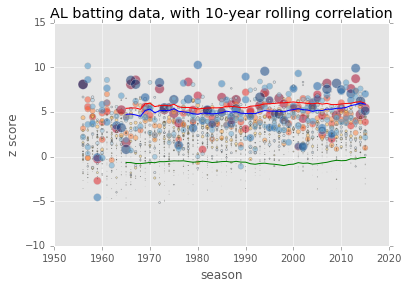


Let's examine one outlier in the AL batting data: using the 1-year graph, we can see a big drop in 2002. Who is this? 


```python
battingAL[battingAL['yearID'] == 2002].sort_values('pointsPct', ascending = False).head()
```


<div>
<table border="1" class="dataframe">
  <thead>
    <tr style="text-align: right;">
      <th></th>
      <th>playerID</th>
      <th>yearID</th>
      <th>stint</th>
      <th>teamID</th>
      <th>lgID</th>
      <th>G</th>
      <th>AB</th>
      <th>R</th>
      <th>H</th>
      <th>2B</th>
      <th>...</th>
      <th>1B</th>
      <th>wOBA</th>
      <th>zAVG</th>
      <th>zHR</th>
      <th>zRBI</th>
      <th>zOBP</th>
      <th>zSLG</th>
      <th>zwOBA</th>
      <th>zOld</th>
      <th>zNew</th>
    </tr>
  </thead>
  <tbody>
    <tr>
      <th>5532</th>
      <td>tejadmi01</td>
      <td>2002</td>
      <td>1</td>
      <td>OAK</td>
      <td>AL</td>
      <td>162</td>
      <td>662.0</td>
      <td>108.0</td>
      <td>204.0</td>
      <td>30.0</td>
      <td>...</td>
      <td>140.0</td>
      <td>0.370743</td>
      <td>1.107623</td>
      <td>1.122901</td>
      <td>2.021804</td>
      <td>0.090183</td>
      <td>0.562875</td>
      <td>0.469229</td>
      <td>4.252328</td>
      <td>1.122286</td>
    </tr>
    <tr>
      <th>5517</th>
      <td>rodrial01</td>
      <td>2002</td>
      <td>1</td>
      <td>TEX</td>
      <td>AL</td>
      <td>162</td>
      <td>624.0</td>
      <td>125.0</td>
      <td>187.0</td>
      <td>27.0</td>
      <td>...</td>
      <td>101.0</td>
      <td>0.424247</td>
      <td>0.790132</td>
      <td>3.226156</td>
      <td>2.492635</td>
      <td>1.136924</td>
      <td>2.174352</td>
      <td>1.852536</td>
      <td>6.508924</td>
      <td>5.163812</td>
    </tr>
    <tr>
      <th>5525</th>
      <td>soriaal01</td>
      <td>2002</td>
      <td>1</td>
      <td>NYA</td>
      <td>AL</td>
      <td>156</td>
      <td>696.0</td>
      <td>128.0</td>
      <td>209.0</td>
      <td>51.0</td>
      <td>...</td>
      <td>117.0</td>
      <td>0.373654</td>
      <td>0.812897</td>
      <td>1.580131</td>
      <td>0.780522</td>
      <td>-0.501576</td>
      <td>1.117367</td>
      <td>0.544481</td>
      <td>3.173550</td>
      <td>1.160272</td>
    </tr>
    <tr>
      <th>5418</th>
      <td>anderga01</td>
      <td>2002</td>
      <td>1</td>
      <td>ANA</td>
      <td>AL</td>
      <td>158</td>
      <td>638.0</td>
      <td>93.0</td>
      <td>195.0</td>
      <td>56.0</td>
      <td>...</td>
      <td>107.0</td>
      <td>0.363501</td>
      <td>1.013455</td>
      <td>0.665672</td>
      <td>1.679382</td>
      <td>-0.517439</td>
      <td>1.002898</td>
      <td>0.281986</td>
      <td>3.358508</td>
      <td>0.767446</td>
    </tr>
    <tr>
      <th>5458</th>
      <td>giambja01</td>
      <td>2002</td>
      <td>1</td>
      <td>NYA</td>
      <td>AL</td>
      <td>155</td>
      <td>560.0</td>
      <td>120.0</td>
      <td>176.0</td>
      <td>34.0</td>
      <td>...</td>
      <td>100.0</td>
      <td>0.439793</td>
      <td>1.337142</td>
      <td>1.763022</td>
      <td>1.636579</td>
      <td>2.344264</td>
      <td>1.824037</td>
      <td>2.254464</td>
      <td>4.736743</td>
      <td>6.422765</td>
    </tr>
  </tbody>
</table>
<p>5 rows × 43 columns</p>
</div>


It is Miguel Tejada, shortstop for the Oakland A's. While he was modestly impressive in the Triple Crown stats (6th in zOld), Tejada was only 16th in zNew. A big reason for this is his meager walk rate - Tejada's OBP was barely above the sample average, and his slugging percentage wasn't particularly impressive either. While Tejada hit a good share of home runs, he did not hit a correspondingly large share of doubles (thus his zHR is higher than both zSlg and zwOBA). He also had a very large number of RBI, something that doesn't directly factor into any of the stats in zNew. Would this season still be awarded the MVP now, almost 15 years later? We can only speculate, but my argument would be no. 


```python
battingAL[battingAL['yearID'] == 2002].sort_values('zOld', ascending = False).head(6)
```


<div>
<table border="1" class="dataframe">
  <thead>
    <tr style="text-align: right;">
      <th></th>
      <th>playerID</th>
      <th>yearID</th>
      <th>stint</th>
      <th>teamID</th>
      <th>lgID</th>
      <th>G</th>
      <th>AB</th>
      <th>R</th>
      <th>H</th>
      <th>2B</th>
      <th>...</th>
      <th>1B</th>
      <th>wOBA</th>
      <th>zAVG</th>
      <th>zHR</th>
      <th>zRBI</th>
      <th>zOBP</th>
      <th>zSLG</th>
      <th>zwOBA</th>
      <th>zOld</th>
      <th>zNew</th>
    </tr>
  </thead>
  <tbody>
    <tr>
      <th>5517</th>
      <td>rodrial01</td>
      <td>2002</td>
      <td>1</td>
      <td>TEX</td>
      <td>AL</td>
      <td>162</td>
      <td>624.0</td>
      <td>125.0</td>
      <td>187.0</td>
      <td>27.0</td>
      <td>...</td>
      <td>101.0</td>
      <td>0.424247</td>
      <td>0.790132</td>
      <td>3.226156</td>
      <td>2.492635</td>
      <td>1.136924</td>
      <td>2.174352</td>
      <td>1.852536</td>
      <td>6.508924</td>
      <td>5.163812</td>
    </tr>
    <tr>
      <th>5505</th>
      <td>ordonma01</td>
      <td>2002</td>
      <td>1</td>
      <td>CHA</td>
      <td>AL</td>
      <td>153</td>
      <td>590.0</td>
      <td>116.0</td>
      <td>189.0</td>
      <td>47.0</td>
      <td>...</td>
      <td>103.0</td>
      <td>0.415192</td>
      <td>1.563839</td>
      <td>1.488685</td>
      <td>2.193016</td>
      <td>0.849327</td>
      <td>1.801722</td>
      <td>1.618429</td>
      <td>5.245540</td>
      <td>4.269479</td>
    </tr>
    <tr>
      <th>5534</th>
      <td>thomeji01</td>
      <td>2002</td>
      <td>1</td>
      <td>CLE</td>
      <td>AL</td>
      <td>147</td>
      <td>480.0</td>
      <td>101.0</td>
      <td>146.0</td>
      <td>19.0</td>
      <td>...</td>
      <td>73.0</td>
      <td>0.460686</td>
      <td>0.958179</td>
      <td>2.768927</td>
      <td>1.465368</td>
      <td>2.618871</td>
      <td>2.921159</td>
      <td>2.794639</td>
      <td>5.192473</td>
      <td>8.334669</td>
    </tr>
    <tr>
      <th>5458</th>
      <td>giambja01</td>
      <td>2002</td>
      <td>1</td>
      <td>NYA</td>
      <td>AL</td>
      <td>155</td>
      <td>560.0</td>
      <td>120.0</td>
      <td>176.0</td>
      <td>34.0</td>
      <td>...</td>
      <td>100.0</td>
      <td>0.439793</td>
      <td>1.337142</td>
      <td>1.763022</td>
      <td>1.636579</td>
      <td>2.344264</td>
      <td>1.824037</td>
      <td>2.254464</td>
      <td>4.736743</td>
      <td>6.422765</td>
    </tr>
    <tr>
      <th>5514</th>
      <td>ramirma02</td>
      <td>2002</td>
      <td>1</td>
      <td>BOS</td>
      <td>AL</td>
      <td>120</td>
      <td>436.0</td>
      <td>84.0</td>
      <td>152.0</td>
      <td>31.0</td>
      <td>...</td>
      <td>88.0</td>
      <td>0.459345</td>
      <td>2.623120</td>
      <td>1.031455</td>
      <td>0.994536</td>
      <td>2.742017</td>
      <td>2.499744</td>
      <td>2.759982</td>
      <td>4.649112</td>
      <td>8.001743</td>
    </tr>
    <tr>
      <th>5532</th>
      <td>tejadmi01</td>
      <td>2002</td>
      <td>1</td>
      <td>OAK</td>
      <td>AL</td>
      <td>162</td>
      <td>662.0</td>
      <td>108.0</td>
      <td>204.0</td>
      <td>30.0</td>
      <td>...</td>
      <td>140.0</td>
      <td>0.370743</td>
      <td>1.107623</td>
      <td>1.122901</td>
      <td>2.021804</td>
      <td>0.090183</td>
      <td>0.562875</td>
      <td>0.469229</td>
      <td>4.252328</td>
      <td>1.122286</td>
    </tr>
  </tbody>
</table>
<p>6 rows × 43 columns</p>
</div>


```python
battingAL[battingAL['yearID'] == 2002].sort_values('zNew', ascending = False).head(16)
```


<div>
<table border="1" class="dataframe">
  <thead>
    <tr style="text-align: right;">
      <th></th>
      <th>playerID</th>
      <th>yearID</th>
      <th>stint</th>
      <th>teamID</th>
      <th>lgID</th>
      <th>G</th>
      <th>AB</th>
      <th>R</th>
      <th>H</th>
      <th>2B</th>
      <th>...</th>
      <th>1B</th>
      <th>wOBA</th>
      <th>zAVG</th>
      <th>zHR</th>
      <th>zRBI</th>
      <th>zOBP</th>
      <th>zSLG</th>
      <th>zwOBA</th>
      <th>zOld</th>
      <th>zNew</th>
    </tr>
  </thead>
  <tbody>
    <tr>
      <th>5534</th>
      <td>thomeji01</td>
      <td>2002</td>
      <td>1</td>
      <td>CLE</td>
      <td>AL</td>
      <td>147</td>
      <td>480.0</td>
      <td>101.0</td>
      <td>146.0</td>
      <td>19.0</td>
      <td>...</td>
      <td>73.0</td>
      <td>0.460686</td>
      <td>0.958179</td>
      <td>2.768927</td>
      <td>1.465368</td>
      <td>2.618871</td>
      <td>2.921159</td>
      <td>2.794639</td>
      <td>5.192473</td>
      <td>8.334669</td>
    </tr>
    <tr>
      <th>5514</th>
      <td>ramirma02</td>
      <td>2002</td>
      <td>1</td>
      <td>BOS</td>
      <td>AL</td>
      <td>120</td>
      <td>436.0</td>
      <td>84.0</td>
      <td>152.0</td>
      <td>31.0</td>
      <td>...</td>
      <td>88.0</td>
      <td>0.459345</td>
      <td>2.623120</td>
      <td>1.031455</td>
      <td>0.994536</td>
      <td>2.742017</td>
      <td>2.499744</td>
      <td>2.759982</td>
      <td>4.649112</td>
      <td>8.001743</td>
    </tr>
    <tr>
      <th>5458</th>
      <td>giambja01</td>
      <td>2002</td>
      <td>1</td>
      <td>NYA</td>
      <td>AL</td>
      <td>155</td>
      <td>560.0</td>
      <td>120.0</td>
      <td>176.0</td>
      <td>34.0</td>
      <td>...</td>
      <td>100.0</td>
      <td>0.439793</td>
      <td>1.337142</td>
      <td>1.763022</td>
      <td>1.636579</td>
      <td>2.344264</td>
      <td>1.824037</td>
      <td>2.254464</td>
      <td>4.736743</td>
      <td>6.422765</td>
    </tr>
    <tr>
      <th>5517</th>
      <td>rodrial01</td>
      <td>2002</td>
      <td>1</td>
      <td>TEX</td>
      <td>AL</td>
      <td>162</td>
      <td>624.0</td>
      <td>125.0</td>
      <td>187.0</td>
      <td>27.0</td>
      <td>...</td>
      <td>101.0</td>
      <td>0.424247</td>
      <td>0.790132</td>
      <td>3.226156</td>
      <td>2.492635</td>
      <td>1.136924</td>
      <td>2.174352</td>
      <td>1.852536</td>
      <td>6.508924</td>
      <td>5.163812</td>
    </tr>
    <tr>
      <th>5531</th>
      <td>sweenmi01</td>
      <td>2002</td>
      <td>1</td>
      <td>KCA</td>
      <td>AL</td>
      <td>126</td>
      <td>471.0</td>
      <td>81.0</td>
      <td>160.0</td>
      <td>31.0</td>
      <td>...</td>
      <td>104.0</td>
      <td>0.415090</td>
      <td>2.289021</td>
      <td>0.208443</td>
      <td>0.095677</td>
      <td>1.821974</td>
      <td>1.329073</td>
      <td>1.615785</td>
      <td>2.593141</td>
      <td>4.766832</td>
    </tr>
    <tr>
      <th>5505</th>
      <td>ordonma01</td>
      <td>2002</td>
      <td>1</td>
      <td>CHA</td>
      <td>AL</td>
      <td>153</td>
      <td>590.0</td>
      <td>116.0</td>
      <td>189.0</td>
      <td>47.0</td>
      <td>...</td>
      <td>103.0</td>
      <td>0.415192</td>
      <td>1.563839</td>
      <td>1.488685</td>
      <td>2.193016</td>
      <td>0.849327</td>
      <td>1.801722</td>
      <td>1.618429</td>
      <td>5.245540</td>
      <td>4.269479</td>
    </tr>
    <tr>
      <th>5448</th>
      <td>delgaca01</td>
      <td>2002</td>
      <td>1</td>
      <td>TOR</td>
      <td>AL</td>
      <td>143</td>
      <td>505.0</td>
      <td>103.0</td>
      <td>140.0</td>
      <td>34.0</td>
      <td>...</td>
      <td>71.0</td>
      <td>0.400902</td>
      <td>-0.050696</td>
      <td>1.031455</td>
      <td>1.037339</td>
      <td>1.532839</td>
      <td>1.132684</td>
      <td>1.248961</td>
      <td>2.018098</td>
      <td>3.914484</td>
    </tr>
    <tr>
      <th>5506</th>
      <td>palmera01</td>
      <td>2002</td>
      <td>1</td>
      <td>TEX</td>
      <td>AL</td>
      <td>155</td>
      <td>546.0</td>
      <td>99.0</td>
      <td>149.0</td>
      <td>34.0</td>
      <td>...</td>
      <td>72.0</td>
      <td>0.402100</td>
      <td>-0.213005</td>
      <td>1.945914</td>
      <td>0.908931</td>
      <td>1.107201</td>
      <td>1.451429</td>
      <td>1.279956</td>
      <td>2.641840</td>
      <td>3.838586</td>
    </tr>
    <tr>
      <th>5548</th>
      <td>willibe02</td>
      <td>2002</td>
      <td>1</td>
      <td>NYA</td>
      <td>AL</td>
      <td>154</td>
      <td>612.0</td>
      <td>102.0</td>
      <td>204.0</td>
      <td>37.0</td>
      <td>...</td>
      <td>146.0</td>
      <td>0.395866</td>
      <td>2.050484</td>
      <td>-0.248787</td>
      <td>0.780522</td>
      <td>1.776782</td>
      <td>0.366889</td>
      <td>1.118758</td>
      <td>2.582219</td>
      <td>3.262429</td>
    </tr>
    <tr>
      <th>5504</th>
      <td>olerujo01</td>
      <td>2002</td>
      <td>1</td>
      <td>SEA</td>
      <td>AL</td>
      <td>154</td>
      <td>553.0</td>
      <td>85.0</td>
      <td>166.0</td>
      <td>39.0</td>
      <td>...</td>
      <td>105.0</td>
      <td>0.385967</td>
      <td>0.808908</td>
      <td>0.025551</td>
      <td>0.780522</td>
      <td>1.440088</td>
      <td>0.319457</td>
      <td>0.862830</td>
      <td>1.614981</td>
      <td>2.622375</td>
    </tr>
    <tr>
      <th>5432</th>
      <td>burksel01</td>
      <td>2002</td>
      <td>1</td>
      <td>CLE</td>
      <td>AL</td>
      <td>138</td>
      <td>518.0</td>
      <td>92.0</td>
      <td>156.0</td>
      <td>28.0</td>
      <td>...</td>
      <td>96.0</td>
      <td>0.386428</td>
      <td>0.845514</td>
      <td>0.940010</td>
      <td>0.309691</td>
      <td>0.316579</td>
      <td>1.021756</td>
      <td>0.874744</td>
      <td>2.095215</td>
      <td>2.213078</td>
    </tr>
    <tr>
      <th>5519</th>
      <td>salmoti01</td>
      <td>2002</td>
      <td>1</td>
      <td>ANA</td>
      <td>AL</td>
      <td>138</td>
      <td>483.0</td>
      <td>84.0</td>
      <td>138.0</td>
      <td>37.0</td>
      <td>...</td>
      <td>78.0</td>
      <td>0.380658</td>
      <td>0.267129</td>
      <td>0.025551</td>
      <td>0.181283</td>
      <td>0.820717</td>
      <td>0.501010</td>
      <td>0.725586</td>
      <td>0.473963</td>
      <td>2.047313</td>
    </tr>
    <tr>
      <th>5457</th>
      <td>garcino01</td>
      <td>2002</td>
      <td>1</td>
      <td>BOS</td>
      <td>AL</td>
      <td>156</td>
      <td>635.0</td>
      <td>101.0</td>
      <td>197.0</td>
      <td>56.0</td>
      <td>...</td>
      <td>112.0</td>
      <td>0.373086</td>
      <td>1.185487</td>
      <td>0.208443</td>
      <td>1.550973</td>
      <td>0.041717</td>
      <td>0.841174</td>
      <td>0.529797</td>
      <td>2.944902</td>
      <td>1.412688</td>
    </tr>
    <tr>
      <th>5477</th>
      <td>ibanera01</td>
      <td>2002</td>
      <td>1</td>
      <td>KCA</td>
      <td>AL</td>
      <td>137</td>
      <td>497.0</td>
      <td>70.0</td>
      <td>146.0</td>
      <td>37.0</td>
      <td>...</td>
      <td>79.0</td>
      <td>0.373623</td>
      <td>0.568541</td>
      <td>0.208443</td>
      <td>0.823325</td>
      <td>-0.120433</td>
      <td>0.975611</td>
      <td>0.543682</td>
      <td>1.600309</td>
      <td>1.398859</td>
    </tr>
    <tr>
      <th>5525</th>
      <td>soriaal01</td>
      <td>2002</td>
      <td>1</td>
      <td>NYA</td>
      <td>AL</td>
      <td>156</td>
      <td>696.0</td>
      <td>128.0</td>
      <td>209.0</td>
      <td>51.0</td>
      <td>...</td>
      <td>117.0</td>
      <td>0.373654</td>
      <td>0.812897</td>
      <td>1.580131</td>
      <td>0.780522</td>
      <td>-0.501576</td>
      <td>1.117367</td>
      <td>0.544481</td>
      <td>3.173550</td>
      <td>1.160272</td>
    </tr>
    <tr>
      <th>5532</th>
      <td>tejadmi01</td>
      <td>2002</td>
      <td>1</td>
      <td>OAK</td>
      <td>AL</td>
      <td>162</td>
      <td>662.0</td>
      <td>108.0</td>
      <td>204.0</td>
      <td>30.0</td>
      <td>...</td>
      <td>140.0</td>
      <td>0.370743</td>
      <td>1.107623</td>
      <td>1.122901</td>
      <td>2.021804</td>
      <td>0.090183</td>
      <td>0.562875</td>
      <td>0.469229</td>
      <td>4.252328</td>
      <td>1.122286</td>
    </tr>
  </tbody>
</table>
<p>16 rows × 43 columns</p>
</div>


#### National League Batting
As with the American League, in the National League data we see the green line ending on an upward trend. However, in all three plots here it appears that the all-time high period was in 2001-2004, when we see four large blue dots clearly sticking out above the rest of the plotted points. A quick subsetting of the data (or some solid knowledge of baseball history) reveals these outliers are all seasons from Barry Bonds, as he was setting records during the peak of Major League Baseball's so-called Steroid Era. Amongst seasons in this dataset, Bonds had the top 4 OBP performances, 4 of top 6 SLG performances, and the top 4 wOBA performances. Talk about an outlier! 


```python
generatePlots(battingNL, 1, "NL batting data, with year-to-year correlation")
```


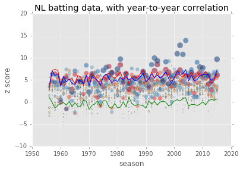


```python
generatePlots(battingNL, 5, "NL batting data, with 5-year rolling correlation")
```


```python
generatePlots(battingNL, 10, "NL batting data, with 10-year rolling correlation")
```


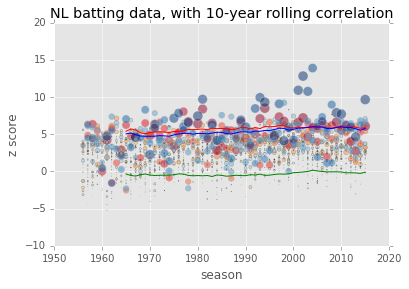


Who are those big blue dots way up there? Barry Bonds and his four straight MVPs. 


```python
battingNL[battingNL['zNew'] > 10]
```


<div>
<table border="1" class="dataframe">
  <thead>
    <tr style="text-align: right;">
      <th></th>
      <th>playerID</th>
      <th>yearID</th>
      <th>stint</th>
      <th>teamID</th>
      <th>lgID</th>
      <th>G</th>
      <th>AB</th>
      <th>R</th>
      <th>H</th>
      <th>2B</th>
      <th>...</th>
      <th>1B</th>
      <th>wOBA</th>
      <th>zAVG</th>
      <th>zHR</th>
      <th>zRBI</th>
      <th>zOBP</th>
      <th>zSLG</th>
      <th>zwOBA</th>
      <th>zOld</th>
      <th>zNew</th>
    </tr>
  </thead>
  <tbody>
    <tr>
      <th>5283</th>
      <td>bondsba01</td>
      <td>2001</td>
      <td>1</td>
      <td>SFN</td>
      <td>NL</td>
      <td>153</td>
      <td>476.0</td>
      <td>129.0</td>
      <td>156.0</td>
      <td>32.0</td>
      <td>...</td>
      <td>49.0</td>
      <td>0.536693</td>
      <td>1.459388</td>
      <td>3.383631</td>
      <td>1.745450</td>
      <td>3.704013</td>
      <td>3.687472</td>
      <td>3.513419</td>
      <td>6.588468</td>
      <td>10.904903</td>
    </tr>
    <tr>
      <th>5429</th>
      <td>bondsba01</td>
      <td>2002</td>
      <td>1</td>
      <td>SFN</td>
      <td>NL</td>
      <td>143</td>
      <td>403.0</td>
      <td>117.0</td>
      <td>149.0</td>
      <td>31.0</td>
      <td>...</td>
      <td>70.0</td>
      <td>0.543401</td>
      <td>3.369402</td>
      <td>2.318123</td>
      <td>1.501774</td>
      <td>4.743519</td>
      <td>4.036920</td>
      <td>4.031276</td>
      <td>7.189299</td>
      <td>12.811715</td>
    </tr>
    <tr>
      <th>5575</th>
      <td>bondsba01</td>
      <td>2003</td>
      <td>1</td>
      <td>SFN</td>
      <td>NL</td>
      <td>130</td>
      <td>390.0</td>
      <td>111.0</td>
      <td>133.0</td>
      <td>22.0</td>
      <td>...</td>
      <td>65.0</td>
      <td>0.502550</td>
      <td>1.957149</td>
      <td>2.172662</td>
      <td>0.490221</td>
      <td>3.973037</td>
      <td>3.443534</td>
      <td>3.341833</td>
      <td>4.620032</td>
      <td>10.758403</td>
    </tr>
    <tr>
      <th>5721</th>
      <td>bondsba01</td>
      <td>2004</td>
      <td>1</td>
      <td>SFN</td>
      <td>NL</td>
      <td>147</td>
      <td>373.0</td>
      <td>129.0</td>
      <td>135.0</td>
      <td>27.0</td>
      <td>...</td>
      <td>60.0</td>
      <td>0.536678</td>
      <td>2.994323</td>
      <td>1.967940</td>
      <td>0.968220</td>
      <td>5.528214</td>
      <td>4.088378</td>
      <td>4.271623</td>
      <td>5.930483</td>
      <td>13.888214</td>
    </tr>
  </tbody>
</table>
<p>4 rows × 43 columns</p>
</div>


```python
battingNL.sort_values('OBP', ascending = False).head()
```


<div>
<table border="1" class="dataframe">
  <thead>
    <tr style="text-align: right;">
      <th></th>
      <th>playerID</th>
      <th>yearID</th>
      <th>stint</th>
      <th>teamID</th>
      <th>lgID</th>
      <th>G</th>
      <th>AB</th>
      <th>R</th>
      <th>H</th>
      <th>2B</th>
      <th>...</th>
      <th>1B</th>
      <th>wOBA</th>
      <th>zAVG</th>
      <th>zHR</th>
      <th>zRBI</th>
      <th>zOBP</th>
      <th>zSLG</th>
      <th>zwOBA</th>
      <th>zOld</th>
      <th>zNew</th>
    </tr>
  </thead>
  <tbody>
    <tr>
      <th>5721</th>
      <td>bondsba01</td>
      <td>2004</td>
      <td>1</td>
      <td>SFN</td>
      <td>NL</td>
      <td>147</td>
      <td>373.0</td>
      <td>129.0</td>
      <td>135.0</td>
      <td>27.0</td>
      <td>...</td>
      <td>60.0</td>
      <td>0.536678</td>
      <td>2.994323</td>
      <td>1.967940</td>
      <td>0.968220</td>
      <td>5.528214</td>
      <td>4.088378</td>
      <td>4.271623</td>
      <td>5.930483</td>
      <td>13.888214</td>
    </tr>
    <tr>
      <th>5429</th>
      <td>bondsba01</td>
      <td>2002</td>
      <td>1</td>
      <td>SFN</td>
      <td>NL</td>
      <td>143</td>
      <td>403.0</td>
      <td>117.0</td>
      <td>149.0</td>
      <td>31.0</td>
      <td>...</td>
      <td>70.0</td>
      <td>0.543401</td>
      <td>3.369402</td>
      <td>2.318123</td>
      <td>1.501774</td>
      <td>4.743519</td>
      <td>4.036920</td>
      <td>4.031276</td>
      <td>7.189299</td>
      <td>12.811715</td>
    </tr>
    <tr>
      <th>5575</th>
      <td>bondsba01</td>
      <td>2003</td>
      <td>1</td>
      <td>SFN</td>
      <td>NL</td>
      <td>130</td>
      <td>390.0</td>
      <td>111.0</td>
      <td>133.0</td>
      <td>22.0</td>
      <td>...</td>
      <td>65.0</td>
      <td>0.502550</td>
      <td>1.957149</td>
      <td>2.172662</td>
      <td>0.490221</td>
      <td>3.973037</td>
      <td>3.443534</td>
      <td>3.341833</td>
      <td>4.620032</td>
      <td>10.758403</td>
    </tr>
    <tr>
      <th>5283</th>
      <td>bondsba01</td>
      <td>2001</td>
      <td>1</td>
      <td>SFN</td>
      <td>NL</td>
      <td>153</td>
      <td>476.0</td>
      <td>129.0</td>
      <td>156.0</td>
      <td>32.0</td>
      <td>...</td>
      <td>49.0</td>
      <td>0.536693</td>
      <td>1.459388</td>
      <td>3.383631</td>
      <td>1.745450</td>
      <td>3.704013</td>
      <td>3.687472</td>
      <td>3.513419</td>
      <td>6.588468</td>
      <td>10.904903</td>
    </tr>
    <tr>
      <th>6365</th>
      <td>jonesch06</td>
      <td>2008</td>
      <td>1</td>
      <td>ATL</td>
      <td>NL</td>
      <td>128</td>
      <td>439.0</td>
      <td>82.0</td>
      <td>160.0</td>
      <td>24.0</td>
      <td>...</td>
      <td>113.0</td>
      <td>0.445386</td>
      <td>3.341747</td>
      <td>0.116811</td>
      <td>-0.177005</td>
      <td>3.379732</td>
      <td>1.610442</td>
      <td>2.667613</td>
      <td>3.281553</td>
      <td>7.657787</td>
    </tr>
  </tbody>
</table>
<p>5 rows × 43 columns</p>
</div>


```python
battingNL.sort_values('SLG', ascending = False).head(6)
```


<div>
<table border="1" class="dataframe">
  <thead>
    <tr style="text-align: right;">
      <th></th>
      <th>playerID</th>
      <th>yearID</th>
      <th>stint</th>
      <th>teamID</th>
      <th>lgID</th>
      <th>G</th>
      <th>AB</th>
      <th>R</th>
      <th>H</th>
      <th>2B</th>
      <th>...</th>
      <th>1B</th>
      <th>wOBA</th>
      <th>zAVG</th>
      <th>zHR</th>
      <th>zRBI</th>
      <th>zOBP</th>
      <th>zSLG</th>
      <th>zwOBA</th>
      <th>zOld</th>
      <th>zNew</th>
    </tr>
  </thead>
  <tbody>
    <tr>
      <th>5283</th>
      <td>bondsba01</td>
      <td>2001</td>
      <td>1</td>
      <td>SFN</td>
      <td>NL</td>
      <td>153</td>
      <td>476.0</td>
      <td>129.0</td>
      <td>156.0</td>
      <td>32.0</td>
      <td>...</td>
      <td>49.0</td>
      <td>0.536693</td>
      <td>1.459388</td>
      <td>3.383631</td>
      <td>1.745450</td>
      <td>3.704013</td>
      <td>3.687472</td>
      <td>3.513419</td>
      <td>6.588468</td>
      <td>10.904903</td>
    </tr>
    <tr>
      <th>5721</th>
      <td>bondsba01</td>
      <td>2004</td>
      <td>1</td>
      <td>SFN</td>
      <td>NL</td>
      <td>147</td>
      <td>373.0</td>
      <td>129.0</td>
      <td>135.0</td>
      <td>27.0</td>
      <td>...</td>
      <td>60.0</td>
      <td>0.536678</td>
      <td>2.994323</td>
      <td>1.967940</td>
      <td>0.968220</td>
      <td>5.528214</td>
      <td>4.088378</td>
      <td>4.271623</td>
      <td>5.930483</td>
      <td>13.888214</td>
    </tr>
    <tr>
      <th>5429</th>
      <td>bondsba01</td>
      <td>2002</td>
      <td>1</td>
      <td>SFN</td>
      <td>NL</td>
      <td>143</td>
      <td>403.0</td>
      <td>117.0</td>
      <td>149.0</td>
      <td>31.0</td>
      <td>...</td>
      <td>70.0</td>
      <td>0.543401</td>
      <td>3.369402</td>
      <td>2.318123</td>
      <td>1.501774</td>
      <td>4.743519</td>
      <td>4.036920</td>
      <td>4.031276</td>
      <td>7.189299</td>
      <td>12.811715</td>
    </tr>
    <tr>
      <th>4914</th>
      <td>mcgwima01</td>
      <td>1998</td>
      <td>1</td>
      <td>SLN</td>
      <td>NL</td>
      <td>155</td>
      <td>509.0</td>
      <td>130.0</td>
      <td>152.0</td>
      <td>21.0</td>
      <td>...</td>
      <td>61.0</td>
      <td>0.492587</td>
      <td>0.433297</td>
      <td>3.572180</td>
      <td>2.292094</td>
      <td>2.835288</td>
      <td>3.322646</td>
      <td>3.073089</td>
      <td>6.297571</td>
      <td>9.231024</td>
    </tr>
    <tr>
      <th>4261</th>
      <td>bagweje01</td>
      <td>1994</td>
      <td>1</td>
      <td>HOU</td>
      <td>NL</td>
      <td>110</td>
      <td>400.0</td>
      <td>104.0</td>
      <td>147.0</td>
      <td>32.0</td>
      <td>...</td>
      <td>74.0</td>
      <td>0.487802</td>
      <td>2.659520</td>
      <td>2.807072</td>
      <td>3.030119</td>
      <td>2.715167</td>
      <td>3.330792</td>
      <td>3.264805</td>
      <td>8.496711</td>
      <td>9.310764</td>
    </tr>
    <tr>
      <th>5575</th>
      <td>bondsba01</td>
      <td>2003</td>
      <td>1</td>
      <td>SFN</td>
      <td>NL</td>
      <td>130</td>
      <td>390.0</td>
      <td>111.0</td>
      <td>133.0</td>
      <td>22.0</td>
      <td>...</td>
      <td>65.0</td>
      <td>0.502550</td>
      <td>1.957149</td>
      <td>2.172662</td>
      <td>0.490221</td>
      <td>3.973037</td>
      <td>3.443534</td>
      <td>3.341833</td>
      <td>4.620032</td>
      <td>10.758403</td>
    </tr>
  </tbody>
</table>
<p>6 rows × 43 columns</p>
</div>


```python
battingNL.sort_values('wOBA', ascending = False).head()
```


<div>
<table border="1" class="dataframe">
  <thead>
    <tr style="text-align: right;">
      <th></th>
      <th>playerID</th>
      <th>yearID</th>
      <th>stint</th>
      <th>teamID</th>
      <th>lgID</th>
      <th>G</th>
      <th>AB</th>
      <th>R</th>
      <th>H</th>
      <th>2B</th>
      <th>...</th>
      <th>1B</th>
      <th>wOBA</th>
      <th>zAVG</th>
      <th>zHR</th>
      <th>zRBI</th>
      <th>zOBP</th>
      <th>zSLG</th>
      <th>zwOBA</th>
      <th>zOld</th>
      <th>zNew</th>
    </tr>
  </thead>
  <tbody>
    <tr>
      <th>5429</th>
      <td>bondsba01</td>
      <td>2002</td>
      <td>1</td>
      <td>SFN</td>
      <td>NL</td>
      <td>143</td>
      <td>403.0</td>
      <td>117.0</td>
      <td>149.0</td>
      <td>31.0</td>
      <td>...</td>
      <td>70.0</td>
      <td>0.543401</td>
      <td>3.369402</td>
      <td>2.318123</td>
      <td>1.501774</td>
      <td>4.743519</td>
      <td>4.036920</td>
      <td>4.031276</td>
      <td>7.189299</td>
      <td>12.811715</td>
    </tr>
    <tr>
      <th>5283</th>
      <td>bondsba01</td>
      <td>2001</td>
      <td>1</td>
      <td>SFN</td>
      <td>NL</td>
      <td>153</td>
      <td>476.0</td>
      <td>129.0</td>
      <td>156.0</td>
      <td>32.0</td>
      <td>...</td>
      <td>49.0</td>
      <td>0.536693</td>
      <td>1.459388</td>
      <td>3.383631</td>
      <td>1.745450</td>
      <td>3.704013</td>
      <td>3.687472</td>
      <td>3.513419</td>
      <td>6.588468</td>
      <td>10.904903</td>
    </tr>
    <tr>
      <th>5721</th>
      <td>bondsba01</td>
      <td>2004</td>
      <td>1</td>
      <td>SFN</td>
      <td>NL</td>
      <td>147</td>
      <td>373.0</td>
      <td>129.0</td>
      <td>135.0</td>
      <td>27.0</td>
      <td>...</td>
      <td>60.0</td>
      <td>0.536678</td>
      <td>2.994323</td>
      <td>1.967940</td>
      <td>0.968220</td>
      <td>5.528214</td>
      <td>4.088378</td>
      <td>4.271623</td>
      <td>5.930483</td>
      <td>13.888214</td>
    </tr>
    <tr>
      <th>5575</th>
      <td>bondsba01</td>
      <td>2003</td>
      <td>1</td>
      <td>SFN</td>
      <td>NL</td>
      <td>130</td>
      <td>390.0</td>
      <td>111.0</td>
      <td>133.0</td>
      <td>22.0</td>
      <td>...</td>
      <td>65.0</td>
      <td>0.502550</td>
      <td>1.957149</td>
      <td>2.172662</td>
      <td>0.490221</td>
      <td>3.973037</td>
      <td>3.443534</td>
      <td>3.341833</td>
      <td>4.620032</td>
      <td>10.758403</td>
    </tr>
    <tr>
      <th>4914</th>
      <td>mcgwima01</td>
      <td>1998</td>
      <td>1</td>
      <td>SLN</td>
      <td>NL</td>
      <td>155</td>
      <td>509.0</td>
      <td>130.0</td>
      <td>152.0</td>
      <td>21.0</td>
      <td>...</td>
      <td>61.0</td>
      <td>0.492587</td>
      <td>0.433297</td>
      <td>3.572180</td>
      <td>2.292094</td>
      <td>2.835288</td>
      <td>3.322646</td>
      <td>3.073089</td>
      <td>6.297571</td>
      <td>9.231024</td>
    </tr>
  </tbody>
</table>
<p>5 rows × 43 columns</p>
</div>


#### American League Pitching
Looking at the American League pitching data, we notice a strange gap during the 50s/60s - this is because until 1968 the award was given to only one player for all of Major League Baseball, not one for each league. 

The correlation here peaks in either the early or mid-2000s, depending on which plot you are using. Since that time, the correlation has trended down a bit. 


```python
generatePlots(pitchingAL, 1, "AL pitching data, with year-to-year correlation")
```


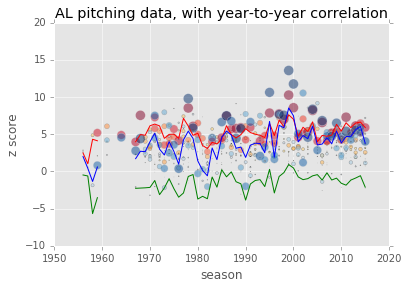


```python
generatePlots(pitchingAL, 5, "AL pitching data, with 5-year rolling correlation")
```


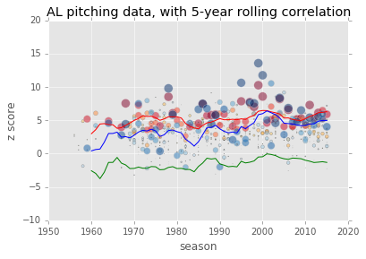


```python
generatePlots(pitchingAL, 10, "AL pitching data, with 10-year rolling correlation")
```


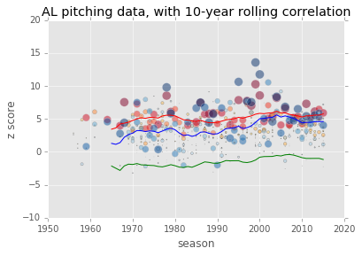


The mid-to-late '90s saw some of the most dominant pitching performances in the history of baseball - the work of two men, Randy Johnson and Pedro Maritnez. We have three Cy Young winning seasons here, but Pedro did not win in 2002. 


```python
pitchingAL[pitchingAL['zNew'] > 10]
```


<div>
<table border="1" class="dataframe">
  <thead>
    <tr style="text-align: right;">
      <th></th>
      <th>playerID</th>
      <th>yearID</th>
      <th>stint</th>
      <th>teamID</th>
      <th>lgID</th>
      <th>W</th>
      <th>L</th>
      <th>G</th>
      <th>GS</th>
      <th>CG</th>
      <th>...</th>
      <th>pointsPct</th>
      <th>FIP</th>
      <th>KBB</th>
      <th>zERA</th>
      <th>zW</th>
      <th>zSO</th>
      <th>zFIP</th>
      <th>zKBB</th>
      <th>zOld</th>
      <th>zNew</th>
    </tr>
  </thead>
  <tbody>
    <tr>
      <th>2979</th>
      <td>johnsra05</td>
      <td>1995</td>
      <td>1</td>
      <td>SEA</td>
      <td>AL</td>
      <td>18</td>
      <td>2</td>
      <td>30</td>
      <td>30</td>
      <td>6</td>
      <td>...</td>
      <td>0.971429</td>
      <td>2.081227</td>
      <td>0.264434</td>
      <td>-2.442192</td>
      <td>1.805800</td>
      <td>3.603403</td>
      <td>-3.377840</td>
      <td>3.704244</td>
      <td>7.851395</td>
      <td>10.623126</td>
    </tr>
    <tr>
      <th>3301</th>
      <td>martipe02</td>
      <td>1999</td>
      <td>1</td>
      <td>BOS</td>
      <td>AL</td>
      <td>23</td>
      <td>4</td>
      <td>31</td>
      <td>29</td>
      <td>5</td>
      <td>...</td>
      <td>1.000000</td>
      <td>1.394937</td>
      <td>0.330539</td>
      <td>-3.168737</td>
      <td>2.768480</td>
      <td>4.320477</td>
      <td>-4.271300</td>
      <td>4.769796</td>
      <td>10.257695</td>
      <td>13.561644</td>
    </tr>
    <tr>
      <th>3382</th>
      <td>martipe02</td>
      <td>2000</td>
      <td>1</td>
      <td>BOS</td>
      <td>AL</td>
      <td>18</td>
      <td>6</td>
      <td>29</td>
      <td>29</td>
      <td>7</td>
      <td>...</td>
      <td>1.000000</td>
      <td>2.170866</td>
      <td>0.308446</td>
      <td>-3.733261</td>
      <td>1.436497</td>
      <td>3.388981</td>
      <td>-3.669948</td>
      <td>4.164428</td>
      <td>8.558738</td>
      <td>11.751564</td>
    </tr>
    <tr>
      <th>3532</th>
      <td>martipe02</td>
      <td>2002</td>
      <td>1</td>
      <td>BOS</td>
      <td>AL</td>
      <td>20</td>
      <td>4</td>
      <td>30</td>
      <td>30</td>
      <td>2</td>
      <td>...</td>
      <td>0.685714</td>
      <td>2.239592</td>
      <td>0.252859</td>
      <td>-2.142698</td>
      <td>1.412088</td>
      <td>3.505033</td>
      <td>-3.081281</td>
      <td>3.939416</td>
      <td>7.059819</td>
      <td>10.531045</td>
    </tr>
  </tbody>
</table>
<p>4 rows × 46 columns</p>
</div>


Who defeated Martinez that year? It was Barry Zito, teammate of the aforementioned Miguel Tejada! (It seems like 2002 was a great year for the A's and a poor year for advanced metrics.) Zito's zNew score was over 9 points lower than Pedro's, while his zOld was closer, but still lower (by about 2 points). Zito led in perhaps the biggest metric - wins. Also, his A's made the playoffs, while Martinez's Red Sox did not. A team's performance (most of which is independent from any one individual) often factors into the voting for individual awards. I did not attempt to account for that in this study, as what I was trying to determine - essentially whether more advanced stats are gaining more cachet with awards voters - isn't related to team performance; if we are measuring the difference between correlations with zOld and zNew, team performance would not factor in anywhere. 


```python
pitchingAL[pitchingAL['yearID'] == 2002].sort_values('pointsPct', ascending = False).head()
```


<div>
<table border="1" class="dataframe">
  <thead>
    <tr style="text-align: right;">
      <th></th>
      <th>playerID</th>
      <th>yearID</th>
      <th>stint</th>
      <th>teamID</th>
      <th>lgID</th>
      <th>W</th>
      <th>L</th>
      <th>G</th>
      <th>GS</th>
      <th>CG</th>
      <th>...</th>
      <th>pointsPct</th>
      <th>FIP</th>
      <th>KBB</th>
      <th>zERA</th>
      <th>zW</th>
      <th>zSO</th>
      <th>zFIP</th>
      <th>zKBB</th>
      <th>zOld</th>
      <th>zNew</th>
    </tr>
  </thead>
  <tbody>
    <tr>
      <th>3574</th>
      <td>zitoba01</td>
      <td>2002</td>
      <td>1</td>
      <td>OAK</td>
      <td>AL</td>
      <td>23</td>
      <td>5</td>
      <td>35</td>
      <td>35</td>
      <td>1</td>
      <td>...</td>
      <td>0.814286</td>
      <td>3.873337</td>
      <td>0.110756</td>
      <td>-1.531414</td>
      <td>2.062469</td>
      <td>1.525886</td>
      <td>-0.369473</td>
      <td>0.425035</td>
      <td>5.119768</td>
      <td>1.191763</td>
    </tr>
    <tr>
      <th>3532</th>
      <td>martipe02</td>
      <td>2002</td>
      <td>1</td>
      <td>BOS</td>
      <td>AL</td>
      <td>20</td>
      <td>4</td>
      <td>30</td>
      <td>30</td>
      <td>2</td>
      <td>...</td>
      <td>0.685714</td>
      <td>2.239592</td>
      <td>0.252859</td>
      <td>-2.142698</td>
      <td>1.412088</td>
      <td>3.505033</td>
      <td>-3.081281</td>
      <td>3.939416</td>
      <td>7.059819</td>
      <td>10.531045</td>
    </tr>
    <tr>
      <th>3530</th>
      <td>lowede01</td>
      <td>2002</td>
      <td>1</td>
      <td>BOS</td>
      <td>AL</td>
      <td>21</td>
      <td>8</td>
      <td>32</td>
      <td>32</td>
      <td>1</td>
      <td>...</td>
      <td>0.292857</td>
      <td>3.335293</td>
      <td>0.092506</td>
      <td>-1.743492</td>
      <td>1.628881</td>
      <td>-0.383817</td>
      <td>-1.262558</td>
      <td>-0.026317</td>
      <td>2.988556</td>
      <td>1.854362</td>
    </tr>
    <tr>
      <th>3567</th>
      <td>washbja01</td>
      <td>2002</td>
      <td>1</td>
      <td>ANA</td>
      <td>AL</td>
      <td>18</td>
      <td>6</td>
      <td>32</td>
      <td>32</td>
      <td>1</td>
      <td>...</td>
      <td>0.007143</td>
      <td>3.714427</td>
      <td>0.093897</td>
      <td>-1.032406</td>
      <td>0.978501</td>
      <td>0.032845</td>
      <td>-0.633244</td>
      <td>0.008081</td>
      <td>2.043752</td>
      <td>0.961987</td>
    </tr>
    <tr>
      <th>3556</th>
      <td>sabatcc01</td>
      <td>2002</td>
      <td>1</td>
      <td>CLE</td>
      <td>AL</td>
      <td>13</td>
      <td>11</td>
      <td>33</td>
      <td>33</td>
      <td>2</td>
      <td>...</td>
      <td>0.000000</td>
      <td>3.866762</td>
      <td>0.068462</td>
      <td>0.489567</td>
      <td>-0.105467</td>
      <td>0.380064</td>
      <td>-0.380388</td>
      <td>-0.620941</td>
      <td>-0.214970</td>
      <td>-0.360831</td>
    </tr>
  </tbody>
</table>
<p>5 rows × 46 columns</p>
</div>


In recent years we have seen the green line drift down again. However, the individual correlation lines are both increasing - taking a look at the data we see that the winners (Dallas Kuechel, Corey Kluber, Max Scherzer) have all had very high zNew scores, they just haven't been quite as high as the zNew scores. 


```python
pitchingAL[pitchingAL['yearID'] == 2015].sort_values('pointsPct', ascending = False).head()
```


<div>
<table border="1" class="dataframe">
  <thead>
    <tr style="text-align: right;">
      <th></th>
      <th>playerID</th>
      <th>yearID</th>
      <th>stint</th>
      <th>teamID</th>
      <th>lgID</th>
      <th>W</th>
      <th>L</th>
      <th>G</th>
      <th>GS</th>
      <th>CG</th>
      <th>...</th>
      <th>pointsPct</th>
      <th>FIP</th>
      <th>KBB</th>
      <th>zERA</th>
      <th>zW</th>
      <th>zSO</th>
      <th>zFIP</th>
      <th>zKBB</th>
      <th>zOld</th>
      <th>zNew</th>
    </tr>
  </thead>
  <tbody>
    <tr>
      <th>4590</th>
      <td>keuchda01</td>
      <td>2015</td>
      <td>1</td>
      <td>HOU</td>
      <td>AL</td>
      <td>20</td>
      <td>8</td>
      <td>33</td>
      <td>33</td>
      <td>3</td>
      <td>...</td>
      <td>0.885714</td>
      <td>2.909862</td>
      <td>0.181120</td>
      <td>-2.160435</td>
      <td>2.428950</td>
      <td>1.314731</td>
      <td>-1.732869</td>
      <td>0.953747</td>
      <td>5.904116</td>
      <td>4.029924</td>
    </tr>
    <tr>
      <th>4579</th>
      <td>grayso01</td>
      <td>2015</td>
      <td>1</td>
      <td>OAK</td>
      <td>AL</td>
      <td>14</td>
      <td>7</td>
      <td>31</td>
      <td>31</td>
      <td>3</td>
      <td>...</td>
      <td>0.390476</td>
      <td>3.451308</td>
      <td>0.132371</td>
      <td>-1.779919</td>
      <td>0.586921</td>
      <td>0.188825</td>
      <td>-0.759097</td>
      <td>-0.007616</td>
      <td>2.555665</td>
      <td>1.127222</td>
    </tr>
    <tr>
      <th>4614</th>
      <td>salech01</td>
      <td>2015</td>
      <td>1</td>
      <td>CHA</td>
      <td>AL</td>
      <td>13</td>
      <td>11</td>
      <td>31</td>
      <td>31</td>
      <td>1</td>
      <td>...</td>
      <td>0.142857</td>
      <td>2.731444</td>
      <td>0.271663</td>
      <td>-0.744916</td>
      <td>0.279916</td>
      <td>2.704148</td>
      <td>-2.053748</td>
      <td>2.739316</td>
      <td>3.728980</td>
      <td>7.189597</td>
    </tr>
    <tr>
      <th>4559</th>
      <td>archech01</td>
      <td>2015</td>
      <td>1</td>
      <td>TBA</td>
      <td>AL</td>
      <td>12</td>
      <td>13</td>
      <td>34</td>
      <td>34</td>
      <td>1</td>
      <td>...</td>
      <td>0.138095</td>
      <td>2.898151</td>
      <td>0.214286</td>
      <td>-1.018887</td>
      <td>-0.027089</td>
      <td>2.177128</td>
      <td>-1.753932</td>
      <td>1.607803</td>
      <td>3.168926</td>
      <td>5.042602</td>
    </tr>
    <tr>
      <th>4585</th>
      <td>hernafe02</td>
      <td>2015</td>
      <td>1</td>
      <td>SEA</td>
      <td>AL</td>
      <td>18</td>
      <td>9</td>
      <td>31</td>
      <td>31</td>
      <td>2</td>
      <td>...</td>
      <td>0.042857</td>
      <td>3.719124</td>
      <td>0.161017</td>
      <td>-0.562268</td>
      <td>1.814940</td>
      <td>0.715845</td>
      <td>-0.277439</td>
      <td>0.557308</td>
      <td>3.093053</td>
      <td>1.252120</td>
    </tr>
  </tbody>
</table>
<p>5 rows × 46 columns</p>
</div>


```python
pitchingAL[pitchingAL['yearID'] == 2014].sort_values('pointsPct', ascending = False).head()
```


<div>
<table border="1" class="dataframe">
  <thead>
    <tr style="text-align: right;">
      <th></th>
      <th>playerID</th>
      <th>yearID</th>
      <th>stint</th>
      <th>teamID</th>
      <th>lgID</th>
      <th>W</th>
      <th>L</th>
      <th>G</th>
      <th>GS</th>
      <th>CG</th>
      <th>...</th>
      <th>pointsPct</th>
      <th>FIP</th>
      <th>KBB</th>
      <th>zERA</th>
      <th>zW</th>
      <th>zSO</th>
      <th>zFIP</th>
      <th>zKBB</th>
      <th>zOld</th>
      <th>zNew</th>
    </tr>
  </thead>
  <tbody>
    <tr>
      <th>4515</th>
      <td>klubeco01</td>
      <td>2014</td>
      <td>1</td>
      <td>CLE</td>
      <td>AL</td>
      <td>18</td>
      <td>9</td>
      <td>34</td>
      <td>34</td>
      <td>3</td>
      <td>...</td>
      <td>0.804762</td>
      <td>2.346993</td>
      <td>0.229232</td>
      <td>-1.612093</td>
      <td>1.954270</td>
      <td>2.905626</td>
      <td>-1.972284</td>
      <td>1.964631</td>
      <td>6.471989</td>
      <td>5.905371</td>
    </tr>
    <tr>
      <th>4505</th>
      <td>hernafe02</td>
      <td>2014</td>
      <td>1</td>
      <td>SEA</td>
      <td>AL</td>
      <td>15</td>
      <td>6</td>
      <td>34</td>
      <td>34</td>
      <td>0</td>
      <td>...</td>
      <td>0.757143</td>
      <td>2.559966</td>
      <td>0.221491</td>
      <td>-2.023691</td>
      <td>0.834739</td>
      <td>2.348651</td>
      <td>-1.650795</td>
      <td>1.805389</td>
      <td>5.207080</td>
      <td>5.184277</td>
    </tr>
    <tr>
      <th>4536</th>
      <td>salech01</td>
      <td>2014</td>
      <td>1</td>
      <td>CHA</td>
      <td>AL</td>
      <td>12</td>
      <td>4</td>
      <td>26</td>
      <td>26</td>
      <td>2</td>
      <td>...</td>
      <td>0.371429</td>
      <td>2.574529</td>
      <td>0.246715</td>
      <td>-1.982531</td>
      <td>-0.284793</td>
      <td>1.287745</td>
      <td>-1.628813</td>
      <td>2.324267</td>
      <td>2.985482</td>
      <td>5.929620</td>
    </tr>
    <tr>
      <th>4538</th>
      <td>scherma01</td>
      <td>2014</td>
      <td>1</td>
      <td>DET</td>
      <td>AL</td>
      <td>18</td>
      <td>5</td>
      <td>33</td>
      <td>33</td>
      <td>1</td>
      <td>...</td>
      <td>0.152381</td>
      <td>2.846070</td>
      <td>0.209071</td>
      <td>-0.637977</td>
      <td>1.954270</td>
      <td>2.454741</td>
      <td>-1.218915</td>
      <td>1.549892</td>
      <td>5.046989</td>
      <td>4.153210</td>
    </tr>
    <tr>
      <th>4531</th>
      <td>priceda01</td>
      <td>2014</td>
      <td>1</td>
      <td>TBA</td>
      <td>AL</td>
      <td>11</td>
      <td>8</td>
      <td>23</td>
      <td>23</td>
      <td>2</td>
      <td>...</td>
      <td>0.076190</td>
      <td>2.932781</td>
      <td>0.240929</td>
      <td>-0.692857</td>
      <td>-0.657970</td>
      <td>0.783814</td>
      <td>-1.088022</td>
      <td>2.205236</td>
      <td>0.818701</td>
      <td>4.939886</td>
    </tr>
  </tbody>
</table>
<p>5 rows × 46 columns</p>
</div>


```python
pitchingAL[pitchingAL['yearID'] == 2013].sort_values('pointsPct', ascending = False).head()
```


<div>
<table border="1" class="dataframe">
  <thead>
    <tr style="text-align: right;">
      <th></th>
      <th>playerID</th>
      <th>yearID</th>
      <th>stint</th>
      <th>teamID</th>
      <th>lgID</th>
      <th>W</th>
      <th>L</th>
      <th>G</th>
      <th>GS</th>
      <th>CG</th>
      <th>...</th>
      <th>pointsPct</th>
      <th>FIP</th>
      <th>KBB</th>
      <th>zERA</th>
      <th>zW</th>
      <th>zSO</th>
      <th>zFIP</th>
      <th>zKBB</th>
      <th>zOld</th>
      <th>zNew</th>
    </tr>
  </thead>
  <tbody>
    <tr>
      <th>4466</th>
      <td>scherma01</td>
      <td>2013</td>
      <td>1</td>
      <td>DET</td>
      <td>AL</td>
      <td>21</td>
      <td>3</td>
      <td>32</td>
      <td>32</td>
      <td>0</td>
      <td>...</td>
      <td>0.966667</td>
      <td>2.740068</td>
      <td>0.220096</td>
      <td>-1.185427</td>
      <td>3.091998</td>
      <td>1.850999</td>
      <td>-1.642518</td>
      <td>2.066693</td>
      <td>6.128424</td>
      <td>5.563815</td>
    </tr>
    <tr>
      <th>4413</th>
      <td>darviyu01</td>
      <td>2013</td>
      <td>1</td>
      <td>TEX</td>
      <td>AL</td>
      <td>13</td>
      <td>9</td>
      <td>32</td>
      <td>32</td>
      <td>0</td>
      <td>...</td>
      <td>0.442857</td>
      <td>3.276935</td>
      <td>0.234245</td>
      <td>-1.290539</td>
      <td>0.153069</td>
      <td>2.780336</td>
      <td>-0.778864</td>
      <td>2.397742</td>
      <td>4.223945</td>
      <td>4.764910</td>
    </tr>
    <tr>
      <th>4433</th>
      <td>iwakuhi01</td>
      <td>2013</td>
      <td>1</td>
      <td>SEA</td>
      <td>AL</td>
      <td>14</td>
      <td>6</td>
      <td>33</td>
      <td>33</td>
      <td>0</td>
      <td>...</td>
      <td>0.347619</td>
      <td>3.444055</td>
      <td>0.165127</td>
      <td>-1.545811</td>
      <td>0.520435</td>
      <td>0.469552</td>
      <td>-0.510020</td>
      <td>0.780593</td>
      <td>2.535798</td>
      <td>1.935918</td>
    </tr>
    <tr>
      <th>4463</th>
      <td>sanchan01</td>
      <td>2013</td>
      <td>1</td>
      <td>DET</td>
      <td>AL</td>
      <td>14</td>
      <td>8</td>
      <td>29</td>
      <td>29</td>
      <td>1</td>
      <td>...</td>
      <td>0.219048</td>
      <td>2.394154</td>
      <td>0.198391</td>
      <td>-1.680954</td>
      <td>0.520435</td>
      <td>0.896545</td>
      <td>-2.198988</td>
      <td>1.558879</td>
      <td>3.097935</td>
      <td>5.636800</td>
    </tr>
    <tr>
      <th>4461</th>
      <td>salech01</td>
      <td>2013</td>
      <td>1</td>
      <td>CHA</td>
      <td>AL</td>
      <td>11</td>
      <td>14</td>
      <td>30</td>
      <td>30</td>
      <td>4</td>
      <td>...</td>
      <td>0.209524</td>
      <td>3.173972</td>
      <td>0.207852</td>
      <td>-0.930156</td>
      <td>-0.581663</td>
      <td>1.499358</td>
      <td>-0.944500</td>
      <td>1.780232</td>
      <td>1.847851</td>
      <td>4.087097</td>
    </tr>
  </tbody>
</table>
<p>5 rows × 46 columns</p>
</div>


#### National League Pitching
Like in the American League data, the green line in the National League pitching data peaked in recent years but has since trended down a bit, while both the red and blue lines trend upward. 


```python
generatePlots(pitchingNL, 1, "NL pitching data, with year-to-year correlation")
```


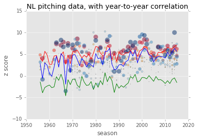


```python
generatePlots(pitchingNL, 5, "NL pitching data, with 5-year rolling correlation")
```


```python
generatePlots(pitchingNL, 10, "NL pitching data, with 10-year rolling correlation")
```


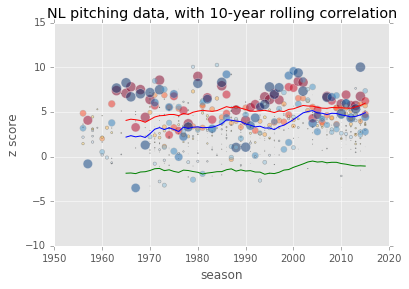


Examing the past few years data, we see a few different stories. In 2015, the best zNew score - Clayton Kershaw - lost out to Jake Arrietta, who had the best zOld score, as well as Zack Greinke, both of whose scores were inferior to Kershaw's. Arrietta and Greinke both gained a big leg up on Kershaw in Wins - much like Barry Zito in 2002 - and also had lower ERAs, while Kershaw had the best FIP of all of the pitchers. 


```python
pitchingNL[pitchingNL['yearID'] == 2015].sort_values('zNew', ascending = False).head()
```


<div>
<table border="1" class="dataframe">
  <thead>
    <tr style="text-align: right;">
      <th></th>
      <th>playerID</th>
      <th>yearID</th>
      <th>stint</th>
      <th>teamID</th>
      <th>lgID</th>
      <th>W</th>
      <th>L</th>
      <th>G</th>
      <th>GS</th>
      <th>CG</th>
      <th>...</th>
      <th>pointsPct</th>
      <th>FIP</th>
      <th>KBB</th>
      <th>zERA</th>
      <th>zW</th>
      <th>zSO</th>
      <th>zFIP</th>
      <th>zKBB</th>
      <th>zOld</th>
      <th>zNew</th>
    </tr>
  </thead>
  <tbody>
    <tr>
      <th>4589</th>
      <td>kershcl01</td>
      <td>2015</td>
      <td>1</td>
      <td>LAN</td>
      <td>NL</td>
      <td>16</td>
      <td>7</td>
      <td>33</td>
      <td>33</td>
      <td>4</td>
      <td>...</td>
      <td>0.480952</td>
      <td>1.990734</td>
      <td>0.291011</td>
      <td>-1.717149</td>
      <td>1.036870</td>
      <td>2.938893</td>
      <td>-2.222327</td>
      <td>2.681360</td>
      <td>5.692912</td>
      <td>7.355531</td>
    </tr>
    <tr>
      <th>4617</th>
      <td>scherma01</td>
      <td>2015</td>
      <td>1</td>
      <td>WAS</td>
      <td>NL</td>
      <td>14</td>
      <td>12</td>
      <td>33</td>
      <td>33</td>
      <td>4</td>
      <td>...</td>
      <td>0.152381</td>
      <td>2.766653</td>
      <td>0.269188</td>
      <td>-0.870486</td>
      <td>0.503187</td>
      <td>2.347601</td>
      <td>-1.117560</td>
      <td>2.259939</td>
      <td>3.721274</td>
      <td>5.066249</td>
    </tr>
    <tr>
      <th>4560</th>
      <td>arrieja01</td>
      <td>2015</td>
      <td>1</td>
      <td>CHN</td>
      <td>NL</td>
      <td>22</td>
      <td>6</td>
      <td>33</td>
      <td>33</td>
      <td>4</td>
      <td>...</td>
      <td>0.804762</td>
      <td>2.347974</td>
      <td>0.216092</td>
      <td>-2.178964</td>
      <td>2.637919</td>
      <td>1.401532</td>
      <td>-1.713682</td>
      <td>1.234620</td>
      <td>6.218415</td>
      <td>4.422453</td>
    </tr>
    <tr>
      <th>4571</th>
      <td>degroja01</td>
      <td>2015</td>
      <td>1</td>
      <td>NYN</td>
      <td>NL</td>
      <td>14</td>
      <td>8</td>
      <td>30</td>
      <td>30</td>
      <td>0</td>
      <td>...</td>
      <td>0.033333</td>
      <td>2.704681</td>
      <td>0.222370</td>
      <td>-1.191192</td>
      <td>0.503187</td>
      <td>0.668330</td>
      <td>-1.205798</td>
      <td>1.355856</td>
      <td>2.362708</td>
      <td>3.842481</td>
    </tr>
    <tr>
      <th>4563</th>
      <td>bumgama01</td>
      <td>2015</td>
      <td>1</td>
      <td>SFN</td>
      <td>NL</td>
      <td>18</td>
      <td>9</td>
      <td>32</td>
      <td>32</td>
      <td>4</td>
      <td>...</td>
      <td>0.038095</td>
      <td>2.872931</td>
      <td>0.224396</td>
      <td>-0.690891</td>
      <td>1.570553</td>
      <td>1.354229</td>
      <td>-0.966240</td>
      <td>1.394973</td>
      <td>3.615673</td>
      <td>3.541820</td>
    </tr>
  </tbody>
</table>
<p>5 rows × 46 columns</p>
</div>


```python
pitchingNL[pitchingNL['yearID'] == 2015].sort_values('zOld', ascending = False).head()
```


<div>
<table border="1" class="dataframe">
  <thead>
    <tr style="text-align: right;">
      <th></th>
      <th>playerID</th>
      <th>yearID</th>
      <th>stint</th>
      <th>teamID</th>
      <th>lgID</th>
      <th>W</th>
      <th>L</th>
      <th>G</th>
      <th>GS</th>
      <th>CG</th>
      <th>...</th>
      <th>pointsPct</th>
      <th>FIP</th>
      <th>KBB</th>
      <th>zERA</th>
      <th>zW</th>
      <th>zSO</th>
      <th>zFIP</th>
      <th>zKBB</th>
      <th>zOld</th>
      <th>zNew</th>
    </tr>
  </thead>
  <tbody>
    <tr>
      <th>4560</th>
      <td>arrieja01</td>
      <td>2015</td>
      <td>1</td>
      <td>CHN</td>
      <td>NL</td>
      <td>22</td>
      <td>6</td>
      <td>33</td>
      <td>33</td>
      <td>4</td>
      <td>...</td>
      <td>0.804762</td>
      <td>2.347974</td>
      <td>0.216092</td>
      <td>-2.178964</td>
      <td>2.637919</td>
      <td>1.401532</td>
      <td>-1.713682</td>
      <td>1.234620</td>
      <td>6.218415</td>
      <td>4.422453</td>
    </tr>
    <tr>
      <th>4589</th>
      <td>kershcl01</td>
      <td>2015</td>
      <td>1</td>
      <td>LAN</td>
      <td>NL</td>
      <td>16</td>
      <td>7</td>
      <td>33</td>
      <td>33</td>
      <td>4</td>
      <td>...</td>
      <td>0.480952</td>
      <td>1.990734</td>
      <td>0.291011</td>
      <td>-1.717149</td>
      <td>1.036870</td>
      <td>2.938893</td>
      <td>-2.222327</td>
      <td>2.681360</td>
      <td>5.692912</td>
      <td>7.355531</td>
    </tr>
    <tr>
      <th>4580</th>
      <td>greinza01</td>
      <td>2015</td>
      <td>1</td>
      <td>LAN</td>
      <td>NL</td>
      <td>19</td>
      <td>3</td>
      <td>32</td>
      <td>32</td>
      <td>1</td>
      <td>...</td>
      <td>0.700000</td>
      <td>2.761246</td>
      <td>0.189798</td>
      <td>-2.320075</td>
      <td>1.837394</td>
      <td>0.550071</td>
      <td>-1.125260</td>
      <td>0.726873</td>
      <td>4.707540</td>
      <td>2.778198</td>
    </tr>
    <tr>
      <th>4617</th>
      <td>scherma01</td>
      <td>2015</td>
      <td>1</td>
      <td>WAS</td>
      <td>NL</td>
      <td>14</td>
      <td>12</td>
      <td>33</td>
      <td>33</td>
      <td>4</td>
      <td>...</td>
      <td>0.152381</td>
      <td>2.766653</td>
      <td>0.269188</td>
      <td>-0.870486</td>
      <td>0.503187</td>
      <td>2.347601</td>
      <td>-1.117560</td>
      <td>2.259939</td>
      <td>3.721274</td>
      <td>5.066249</td>
    </tr>
    <tr>
      <th>4563</th>
      <td>bumgama01</td>
      <td>2015</td>
      <td>1</td>
      <td>SFN</td>
      <td>NL</td>
      <td>18</td>
      <td>9</td>
      <td>32</td>
      <td>32</td>
      <td>4</td>
      <td>...</td>
      <td>0.038095</td>
      <td>2.872931</td>
      <td>0.224396</td>
      <td>-0.690891</td>
      <td>1.570553</td>
      <td>1.354229</td>
      <td>-0.966240</td>
      <td>1.394973</td>
      <td>3.615673</td>
      <td>3.541820</td>
    </tr>
  </tbody>
</table>
<p>5 rows × 46 columns</p>
</div>


In 2014 Kershaw took home the award - easily - as he dominated the field, particularly in the new statistics, but looking closer at the other results tells a more complicated story. The 2nd and 3rd best in zNew (Stephen Strasburg and Jordan Zimmermann) were eclipsed in the voting by the 2nd and 3rd best in zOld (Johnny Cueto and Adam Wainwright). The biggest difference between these two sets of pitchers? It is wins once again; Cueto and Wainwright each had 20, while the two Nationals pitchers had 14.

Luckily for Kershaw, he had 21.


```python
pitchingNL[pitchingNL['yearID'] == 2014].sort_values('zNew', ascending = False).head()
```


<div>
<table border="1" class="dataframe">
  <thead>
    <tr style="text-align: right;">
      <th></th>
      <th>playerID</th>
      <th>yearID</th>
      <th>stint</th>
      <th>teamID</th>
      <th>lgID</th>
      <th>W</th>
      <th>L</th>
      <th>G</th>
      <th>GS</th>
      <th>CG</th>
      <th>...</th>
      <th>pointsPct</th>
      <th>FIP</th>
      <th>KBB</th>
      <th>zERA</th>
      <th>zW</th>
      <th>zSO</th>
      <th>zFIP</th>
      <th>zKBB</th>
      <th>zOld</th>
      <th>zNew</th>
    </tr>
  </thead>
  <tbody>
    <tr>
      <th>4513</th>
      <td>kershcl01</td>
      <td>2014</td>
      <td>1</td>
      <td>LAN</td>
      <td>NL</td>
      <td>21</td>
      <td>3</td>
      <td>27</td>
      <td>27</td>
      <td>6</td>
      <td>...</td>
      <td>1.000000</td>
      <td>1.810992</td>
      <td>0.277704</td>
      <td>-2.304680</td>
      <td>2.325511</td>
      <td>2.107668</td>
      <td>-3.269753</td>
      <td>3.405191</td>
      <td>6.737858</td>
      <td>10.012416</td>
    </tr>
    <tr>
      <th>4541</th>
      <td>strasst01</td>
      <td>2014</td>
      <td>1</td>
      <td>WAS</td>
      <td>NL</td>
      <td>14</td>
      <td>11</td>
      <td>34</td>
      <td>34</td>
      <td>0</td>
      <td>...</td>
      <td>0.014286</td>
      <td>2.941302</td>
      <td>0.229263</td>
      <td>-0.383891</td>
      <td>0.447214</td>
      <td>2.190347</td>
      <td>-1.242565</td>
      <td>2.269019</td>
      <td>3.021452</td>
      <td>5.267376</td>
    </tr>
    <tr>
      <th>4557</th>
      <td>zimmejo02</td>
      <td>2014</td>
      <td>1</td>
      <td>WAS</td>
      <td>NL</td>
      <td>14</td>
      <td>5</td>
      <td>32</td>
      <td>32</td>
      <td>3</td>
      <td>...</td>
      <td>0.119048</td>
      <td>2.681249</td>
      <td>0.191250</td>
      <td>-1.056868</td>
      <td>0.447214</td>
      <td>0.536760</td>
      <td>-1.708966</td>
      <td>1.377440</td>
      <td>2.040841</td>
      <td>4.629609</td>
    </tr>
    <tr>
      <th>4500</th>
      <td>greinza01</td>
      <td>2014</td>
      <td>1</td>
      <td>LAN</td>
      <td>NL</td>
      <td>17</td>
      <td>8</td>
      <td>32</td>
      <td>32</td>
      <td>0</td>
      <td>...</td>
      <td>0.028571</td>
      <td>2.973845</td>
      <td>0.199756</td>
      <td>-0.986766</td>
      <td>1.252198</td>
      <td>1.225755</td>
      <td>-1.184200</td>
      <td>1.576956</td>
      <td>3.464719</td>
      <td>4.141734</td>
    </tr>
    <tr>
      <th>4482</th>
      <td>bumgama01</td>
      <td>2014</td>
      <td>1</td>
      <td>SFN</td>
      <td>NL</td>
      <td>18</td>
      <td>10</td>
      <td>33</td>
      <td>33</td>
      <td>4</td>
      <td>...</td>
      <td>0.133333</td>
      <td>3.049178</td>
      <td>0.201604</td>
      <td>-0.608216</td>
      <td>1.520526</td>
      <td>1.556472</td>
      <td>-1.049092</td>
      <td>1.620283</td>
      <td>3.685215</td>
      <td>4.004064</td>
    </tr>
  </tbody>
</table>
<p>5 rows × 46 columns</p>
</div>


```python
pitchingNL[pitchingNL['yearID'] == 2014].sort_values('zOld', ascending = False).head()
```


<div>
<table border="1" class="dataframe">
  <thead>
    <tr style="text-align: right;">
      <th></th>
      <th>playerID</th>
      <th>yearID</th>
      <th>stint</th>
      <th>teamID</th>
      <th>lgID</th>
      <th>W</th>
      <th>L</th>
      <th>G</th>
      <th>GS</th>
      <th>CG</th>
      <th>...</th>
      <th>pointsPct</th>
      <th>FIP</th>
      <th>KBB</th>
      <th>zERA</th>
      <th>zW</th>
      <th>zSO</th>
      <th>zFIP</th>
      <th>zKBB</th>
      <th>zOld</th>
      <th>zNew</th>
    </tr>
  </thead>
  <tbody>
    <tr>
      <th>4513</th>
      <td>kershcl01</td>
      <td>2014</td>
      <td>1</td>
      <td>LAN</td>
      <td>NL</td>
      <td>21</td>
      <td>3</td>
      <td>27</td>
      <td>27</td>
      <td>6</td>
      <td>...</td>
      <td>1.000000</td>
      <td>1.810992</td>
      <td>0.277704</td>
      <td>-2.304680</td>
      <td>2.325511</td>
      <td>2.107668</td>
      <td>-3.269753</td>
      <td>3.405191</td>
      <td>6.737858</td>
      <td>10.012416</td>
    </tr>
    <tr>
      <th>4488</th>
      <td>cuetojo01</td>
      <td>2014</td>
      <td>1</td>
      <td>CIN</td>
      <td>NL</td>
      <td>20</td>
      <td>9</td>
      <td>34</td>
      <td>34</td>
      <td>4</td>
      <td>...</td>
      <td>0.533333</td>
      <td>3.304367</td>
      <td>0.184183</td>
      <td>-1.631702</td>
      <td>2.057183</td>
      <td>2.190347</td>
      <td>-0.591417</td>
      <td>1.211689</td>
      <td>5.879232</td>
      <td>2.704659</td>
    </tr>
    <tr>
      <th>4550</th>
      <td>wainwad01</td>
      <td>2014</td>
      <td>1</td>
      <td>SLN</td>
      <td>NL</td>
      <td>20</td>
      <td>9</td>
      <td>32</td>
      <td>32</td>
      <td>5</td>
      <td>...</td>
      <td>0.461905</td>
      <td>2.880899</td>
      <td>0.143653</td>
      <td>-1.449438</td>
      <td>2.057183</td>
      <td>0.454080</td>
      <td>-1.350898</td>
      <td>0.261053</td>
      <td>3.960701</td>
      <td>2.417926</td>
    </tr>
    <tr>
      <th>4482</th>
      <td>bumgama01</td>
      <td>2014</td>
      <td>1</td>
      <td>SFN</td>
      <td>NL</td>
      <td>18</td>
      <td>10</td>
      <td>33</td>
      <td>33</td>
      <td>4</td>
      <td>...</td>
      <td>0.133333</td>
      <td>3.049178</td>
      <td>0.201604</td>
      <td>-0.608216</td>
      <td>1.520526</td>
      <td>1.556472</td>
      <td>-1.049092</td>
      <td>1.620283</td>
      <td>3.685215</td>
      <td>4.004064</td>
    </tr>
    <tr>
      <th>4500</th>
      <td>greinza01</td>
      <td>2014</td>
      <td>1</td>
      <td>LAN</td>
      <td>NL</td>
      <td>17</td>
      <td>8</td>
      <td>32</td>
      <td>32</td>
      <td>0</td>
      <td>...</td>
      <td>0.028571</td>
      <td>2.973845</td>
      <td>0.199756</td>
      <td>-0.986766</td>
      <td>1.252198</td>
      <td>1.225755</td>
      <td>-1.184200</td>
      <td>1.576956</td>
      <td>3.464719</td>
      <td>4.141734</td>
    </tr>
  </tbody>
</table>
<p>5 rows × 46 columns</p>
</div>


```python
pitchingNL[pitchingNL['yearID'] == 2014].sort_values('pointsPct', ascending = False).head()
```


<div>
<table border="1" class="dataframe">
  <thead>
    <tr style="text-align: right;">
      <th></th>
      <th>playerID</th>
      <th>yearID</th>
      <th>stint</th>
      <th>teamID</th>
      <th>lgID</th>
      <th>W</th>
      <th>L</th>
      <th>G</th>
      <th>GS</th>
      <th>CG</th>
      <th>...</th>
      <th>pointsPct</th>
      <th>FIP</th>
      <th>KBB</th>
      <th>zERA</th>
      <th>zW</th>
      <th>zSO</th>
      <th>zFIP</th>
      <th>zKBB</th>
      <th>zOld</th>
      <th>zNew</th>
    </tr>
  </thead>
  <tbody>
    <tr>
      <th>4513</th>
      <td>kershcl01</td>
      <td>2014</td>
      <td>1</td>
      <td>LAN</td>
      <td>NL</td>
      <td>21</td>
      <td>3</td>
      <td>27</td>
      <td>27</td>
      <td>6</td>
      <td>...</td>
      <td>1.000000</td>
      <td>1.810992</td>
      <td>0.277704</td>
      <td>-2.304680</td>
      <td>2.325511</td>
      <td>2.107668</td>
      <td>-3.269753</td>
      <td>3.405191</td>
      <td>6.737858</td>
      <td>10.012416</td>
    </tr>
    <tr>
      <th>4488</th>
      <td>cuetojo01</td>
      <td>2014</td>
      <td>1</td>
      <td>CIN</td>
      <td>NL</td>
      <td>20</td>
      <td>9</td>
      <td>34</td>
      <td>34</td>
      <td>4</td>
      <td>...</td>
      <td>0.533333</td>
      <td>3.304367</td>
      <td>0.184183</td>
      <td>-1.631702</td>
      <td>2.057183</td>
      <td>2.190347</td>
      <td>-0.591417</td>
      <td>1.211689</td>
      <td>5.879232</td>
      <td>2.704659</td>
    </tr>
    <tr>
      <th>4550</th>
      <td>wainwad01</td>
      <td>2014</td>
      <td>1</td>
      <td>SLN</td>
      <td>NL</td>
      <td>20</td>
      <td>9</td>
      <td>32</td>
      <td>32</td>
      <td>5</td>
      <td>...</td>
      <td>0.461905</td>
      <td>2.880899</td>
      <td>0.143653</td>
      <td>-1.449438</td>
      <td>2.057183</td>
      <td>0.454080</td>
      <td>-1.350898</td>
      <td>0.261053</td>
      <td>3.960701</td>
      <td>2.417926</td>
    </tr>
    <tr>
      <th>4482</th>
      <td>bumgama01</td>
      <td>2014</td>
      <td>1</td>
      <td>SFN</td>
      <td>NL</td>
      <td>18</td>
      <td>10</td>
      <td>33</td>
      <td>33</td>
      <td>4</td>
      <td>...</td>
      <td>0.133333</td>
      <td>3.049178</td>
      <td>0.201604</td>
      <td>-0.608216</td>
      <td>1.520526</td>
      <td>1.556472</td>
      <td>-1.049092</td>
      <td>1.620283</td>
      <td>3.685215</td>
      <td>4.004064</td>
    </tr>
    <tr>
      <th>4557</th>
      <td>zimmejo02</td>
      <td>2014</td>
      <td>1</td>
      <td>WAS</td>
      <td>NL</td>
      <td>14</td>
      <td>5</td>
      <td>32</td>
      <td>32</td>
      <td>3</td>
      <td>...</td>
      <td>0.119048</td>
      <td>2.681249</td>
      <td>0.191250</td>
      <td>-1.056868</td>
      <td>0.447214</td>
      <td>0.536760</td>
      <td>-1.708966</td>
      <td>1.377440</td>
      <td>2.040841</td>
      <td>4.629609</td>
    </tr>
  </tbody>
</table>
<p>5 rows × 46 columns</p>
</div>


As a sidenote, I felt it would be interesting to plot zOld vs. zNew, with the size of the points once again determined by the pointsPct value. This time, the years are incorporated into the plot via the *colors* of the dots: the years increase as we move "to the right" along the color scale. While each plot uses a different color palette (due simply to the joy of variety), in each case the darkest red points are the oldest data, and the darkest greens and blues are the most recent data. 

What insights can we gain from these plots? From the NL batting data, we can see that most of the years in which the winners (the larger dots) had higher zNew scores than zOld scores were recent seasons (blue dots). The AL pitching data shows a similar trend, though not quite as strong. It is comforting to see that most of the "mistakes" - large dots to the lower-right of the graph, players who did well in the voting but had much better zOld scores than zNew scores - are in shades of red!


```python
def generateScatterplots(data, color = "YlOrRd", title = ""):
    data.loc[:,'yearID'] = data['yearID'].apply(int)
    data = data[data['yearID'] > 1955]
    data['yearID'] = (data['yearID'] - 1956)/2015 #normalizing, for use as color parameter

    plt.scatter(x = data['zOld'], y = data['zNew'], s = 100*(data['pointsPct']**2), color = data['yearID'].apply(str),
               cmap = color, alpha = .5)
    plt.axis([-5,15,-5,15])
    plt.ylabel('zNew')
    plt.xlabel('zOld')
    plt.title(title)
```


```python
generateScatterplots(battingAL, color = "RdYlGn", title = "American League zNew vs. zOld for Batting Data")
```


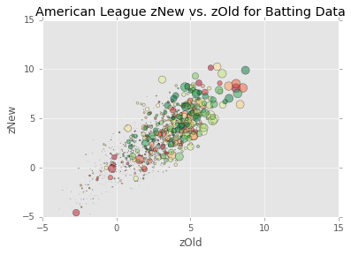


```python
generateScatterplots(battingNL, color = "RdYlBu", title = "National League zNew vs. zOld for Batting Data")
```


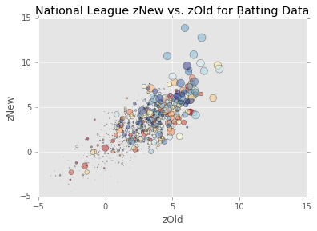


```python
generateScatterplots(pitchingAL, color = "Spectral", title = "American League zNew vs. zOld for Pitching Data")
```


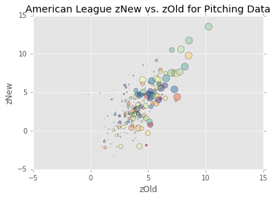


```python
generateScatterplots(pitchingNL, color = "RdBu", title = "National League zNew vs. zOld for Pitching Data")
```


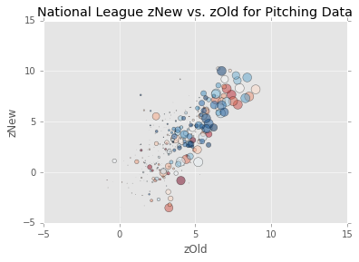


## Conclusions
What can we conclude? For all four subsets of data, it certainly does appear that the new statistics have a stronger relationship relative to the old statistics than they did in the mid-1900s, where our dataset begins. In both sets of batting data, this relationship appears to be at its strongest in the most recent years, while the pitching data sets saw a peak in the early-to-mid 2000s. While the green line isn't at its peak right now in all of the graphs, we can also take it as a positive sign that the blue line (just measuring correlation of the new stats with the voting results) is at or approaching an all-time high level in 3 of the 4 datasets (ex-AL pitching). There is reason to believe that these newer stats are gaining influence. 

There are a number of choices made in the process of conducting this analysis that could have affected the conclusions drawn. Chief among these was the choice of statistics to use as measurements of performance. Using the Triple Crown statistics for the old stats was a simple choice, but was it necessarily correct to equally weight them? In our few examples of the pitching data that we examined, it certainly seemed like Wins were disproportionately important in predicting who would win (or not win) the Cy Young - perhaps this should have been more than 1/3 of the zOld value. For the choice of the advanced statistics, we were a bit limited by the stats that could be calculated from the given datasets. Wins above Replacement is probably the gold standard of advanced stats, but this isn't something we can solve for with the inputs available here. With a more extensive dataset to work with, we could have, if nothing else, created a more starkly "new" set of statistics to use as our comparison to the old stats. Perhaps this would have allowed us to draw stronger conclusions, but we can only speculate. Frankly, it isn't possible to be exhaustive with this process - there are no universally agreed upon "old" or "new" stats that epitomize the "old school" or "new school" ways of looking at the game of baseball. Ultimately, who is to say which of these stats - old or new - are the best measure of a player's true performance anyway? 

The voters, I suppose.

#### Below is a collection of resources I used in completing this report:

SABR website: http://sabr.org/sabermetrics  
FanGraphs "Guts" page: http://www.fangraphs.com/guts.aspx?type=cn  
FanGraphs FIP: http://www.fangraphs.com/library/pitching/fip/  
FanGraphs wOBA: http://www.fangraphs.com/library/offense/woba/  
pandas docs: http://pandas.pydata.org/pandas-docs/stable/index.html  
python docs: https://docs.python.org/2.7/  
stackoverflow: http://stackoverflow.com/  
Triple Crown: https://en.wikipedia.org/wiki/Major_League_Baseball_Triple_Crown  
Steroid Era: https://en.wikipedia.org/wiki/History_of_baseball_in_the_United_States#The_steroid_era

