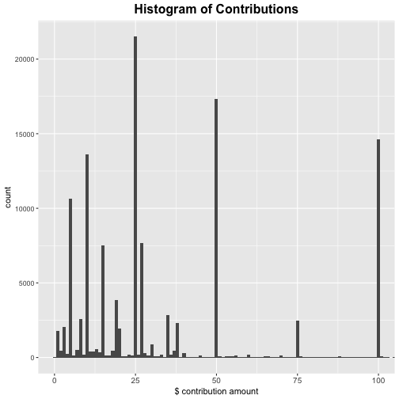
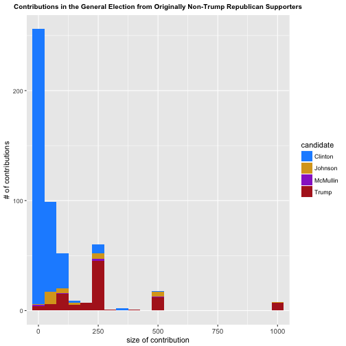
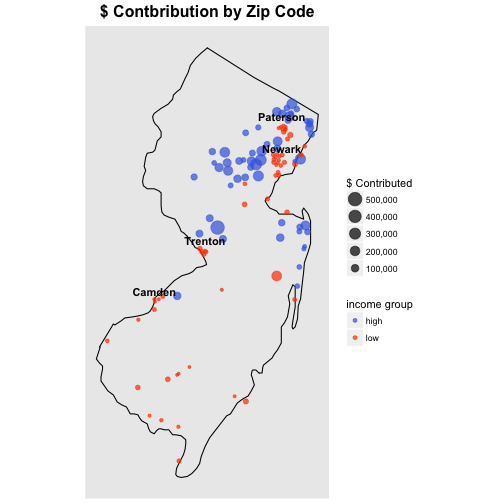

---
output:
  html_document: default
  pdf_document: default
---
#Examining Political Contributions in New Jersey During the 2016 Election Cycle  
by Chad Horner
========================================================

This project will examine the FEC (Federal Elections Commission) contribution data for the 2016 election cycle, focusing specifically on the state of New Jersey.


### Initial Summary


```
## [1] 170293     18
```

```
##       cmte_id           cand_id                           cand_nm     
##  C00575795:90402   P00003392:90402   Clinton, Hillary Rodham  :90402  
##  C00577130:47425   P60007168:47425   Sanders, Bernard         :47425  
##  C00580100:12881   P80001571:12881   Trump, Donald J.         :12881  
##  C00574624: 8091   P60006111: 8091   Cruz, Rafael Edward 'Ted': 8091  
##  C00573519: 3387   P60005915: 3387   Carson, Benjamin S.      : 3387  
##  C00580399: 2811   P60008521: 2811   Christie, Christopher J. : 2811  
##  (Other)  : 5296   (Other)  : 5296   (Other)                  : 5296  
##               contbr_nm           contbr_city     contbr_st  
##  BURGESS, DOUGLAS  :   195   JERSEY CITY:  5599   NJ:170293  
##  KESSLER, CATHERINE:   195   PRINCETON  :  5141              
##  VANACORE, JACKIE  :   175   MONTCLAIR  :  3778              
##  MUELLER, EILEEN   :   169   HOBOKEN    :  2292              
##  TAYLOR, DONALD    :   166   CHERRY HILL:  2165              
##  BERLIN, SUSAN     :   162   MAPLEWOOD  :  2011              
##  (Other)           :169231   (Other)    :149307              
##    contbr_zip            contbr_employer               contbr_occupation 
##  Min.   :      44   N/A          : 23551   RETIRED              : 31898  
##  1st Qu.:70701248   RETIRED      : 15798   NOT EMPLOYED         : 13555  
##  Median :77311559   SELF-EMPLOYED: 10915   ATTORNEY             :  5729  
##  Mean   :71213452   NONE         :  9903   INFORMATION REQUESTED:  4524  
##  3rd Qu.:82512617   NOT EMPLOYED :  5884   TEACHER              :  4153  
##  Max.   :89330001   (Other)      :104129   (Other)              :110416  
##  NA's   :3          NA's         :   113   NA's                 :    18  
##  contb_receipt_amt   contb_receipt_dt 
##  Min.   :-7500.00   12-Jul-16:  1780  
##  1st Qu.:   15.00   31-Mar-16:  1649  
##  Median :   27.00   26-Sep-16:  1645  
##  Mean   :  131.74   31-May-16:  1573  
##  3rd Qu.:   81.72   29-Feb-16:  1538  
##  Max.   :10800.00   19-Oct-16:  1504  
##                     (Other)  :160604  
##                                   receipt_desc    memo_cd   
##                                         :168235    :141671  
##  Refund                                 :  1182   X: 28622  
##  REDESIGNATION TO GENERAL               :   194             
##  REDESIGNATION FROM PRIMARY             :   193             
##  REDESIGNATION TO CRUZ FOR SENATE       :    95             
##  REATTRIBUTION / REDESIGNATION REQUESTED:    82             
##  (Other)                                :   312             
##                                memo_text       form_tp      
##                                     :105219   SA17A:141570  
##  * EARMARKED CONTRIBUTION: SEE BELOW: 45624   SA18 : 27541  
##  * HILLARY VICTORY FUND             : 17904   SB28A:  1182  
##  *BEST EFFORTS UPDATE               :   215                 
##  REDESIGNATION TO GENERAL           :   194                 
##  REDESIGNATION FROM PRIMARY         :   193                 
##  (Other)                            :   944                 
##     file_num                       tran_id       election_tp   
##  Min.   :1003942   AE3C80E7E97A14432B32:     4        :   234  
##  1st Qu.:1077916   AA3550DB23054416E888:     3   G2016: 53369  
##  Median :1094141   ABC3107C1EF354776920:     3   P2016:116688  
##  Mean   :1092131   SA17.1099660        :     3   P2020:     2  
##  3rd Qu.:1109498   C10225909           :     2                 
##  Max.   :1119833   C10246566           :     2                 
##                    (Other)             :170276
```

```
## 'data.frame':	170293 obs. of  18 variables:
##  $ cmte_id          : Factor w/ 24 levels "C00458844","C00500587",..: 7 7 6 6 7 4 4 6 6 4 ...
##  $ cand_id          : Factor w/ 24 levels "P00003392","P20002671",..: 12 12 1 1 12 10 10 1 1 10 ...
##  $ cand_nm          : Factor w/ 24 levels "Bush, Jeb","Carson, Benjamin S.",..: 19 19 4 4 19 5 5 4 4 5 ...
##  $ contbr_nm        : Factor w/ 36212 levels "(SHERRY) GESREGAN, CHERYL ANNE",..: 19165 19171 27533 34185 19651 19740 19740 16941 10446 19740 ...
##  $ contbr_city      : Factor w/ 966 levels "","08332MILLVILLE",..: 351 695 196 421 206 202 202 791 831 202 ...
##  $ contbr_st        : Factor w/ 1 level "NJ": 1 1 1 1 1 1 1 1 1 1 ...
##  $ contbr_zip       : int  78431736 85402212 70172239 77391742 88174072 77243438 77243438 88732328 76661902 77243438 ...
##  $ contbr_employer  : Factor w/ 13849 levels "","--","---",..: 8731 8416 5720 11008 10995 10299 10299 5720 11657 10299 ...
##  $ contbr_occupation: Factor w/ 6559 levels ""," CERTIFIED REGISTERED NURSE ANESTHETIS",..: 3874 401 2966 1586 4428 5002 5002 2966 2150 5002 ...
##  $ contb_receipt_amt: num  5 15 115 26.8 5 ...
##  $ contb_receipt_dt : Factor w/ 596 levels "1-Apr-15","1-Apr-16",..: 529 491 2 558 529 179 255 353 159 499 ...
##  $ receipt_desc     : Factor w/ 24 levels "","* EARMARKED CONTRIBUTION: SEE BELOW REATTRIBUTION/REFUND PENDING",..: 1 1 1 1 1 1 1 1 1 1 ...
##  $ memo_cd          : Factor w/ 2 levels "","X": 1 1 2 2 1 1 1 2 2 1 ...
##  $ memo_text        : Factor w/ 123 levels "","*","* EARMARKED CONTRIBUTION: SEE BELOW",..: 3 3 9 9 3 1 1 9 9 1 ...
##  $ form_tp          : Factor w/ 3 levels "SA17A","SA18",..: 1 1 2 2 1 1 1 2 2 1 ...
##  $ file_num         : int  1077404 1077404 1091718 1091718 1077404 1077664 1077664 1091718 1091718 1077664 ...
##  $ tran_id          : Factor w/ 169954 levels "A0035DEDA026749C9820",..: 139291 138532 53027 53112 139136 108144 108218 53566 53311 107262 ...
##  $ election_tp      : Factor w/ 4 levels "","G2016","P2016",..: 3 3 3 3 3 3 3 3 3 3 ...
```

A simple initial analysis shows us that we have 170,293 observations of 18 variables. The variables that appear to be of greatest interest are:  
- *cand_nm*: name of candidate  
- *contbr_nm*: name of contributor  
- *contbr_city*: city of contributor  
- *contbr_zip*: zip code of contributor  
- *contbr_employer*: employer of contributor  
- *contbr_occupation*: occupation of contributor  
- *contb_receipt_amt*: $ amount of contribution  
- *contb_receipt_dt*: date of contribution  
- *form_tp*: type of form (SA17A, SA18, or SB28A)  
- *election_tp*: which race this was for (primary or general)  

A few questions I will seek to answer in this analysis, using these original variables:  
- how much in total contributions did each candidate receive?  
- was the distribution of contributions different across industries? (e.g. university workers vs. bank workers)  
- how did contributions evolve over time?  

There are a couple useful variables we can create in a straightforward manner:  
- *cand_gender*: gender of the candidate  
- *cand_party*: party of the candidate  


However, there are additional questions I would like to answer. I'd like to look at the relationship between the gender of the donors and the distribution of contributions - but the gender of the donor is not a variable contained in the data. I'd also like to determine if the distribution is different in high-income areas vs. low-income areas. To assist in answering these questions, as well as some others, I created some new variables with the assistance of outside data.

### Gender of Contributors
To create the variable *contbr_gender* I used the [**'gender'** package. ](https://cran.r-project.org/web/packages/gender/gender.pdf) This package uses data from the Social Security Administration to predict the gender of a given first name. While it obviously is not completely accurate (for example, I have a female friend named Kellen, yet this method assigns Kellen as a male name with 91% confidence), and in a small percentage of cases encounters names that it cannot assign one way or the other, for most names there is little ambiguity. 

The **gender** function takes a second or more to run, and we have over 100,000 entries in our dataset! To speed this up, I created a data frame with only unique contributor names. From here, I created a variable *first_name* that is solely the first names, and again cut down to a unique list of names. I then ran the gender function on all of these names, and created a hash table using the [**'hash'** package](https://cran.r-project.org/web/packages/hash/hash.pdf) to relate the names to the gender. From there it was much more efficient to return to the master dataframe and assign a gender to each entry. Instead of 170,293 calls of **gender**, we had only 5,079. 


### Income data
The dataset doesn't contain much information on the individual contributors aside from their location and occupation/employer. In order to see if there are relationships between income and contributions, I grouped together a few sets of data. The first was [tax data from the IRS](https://www.irs.gov/uac/soi-tax-stats-individual-income-tax-statistics-zip-code-data-soi), which gave me Adjusted Gross Income (along with a lot of other statistics) for each zip code. I merged this data with a table of population by zip code ([courtesy of Splitwise](https://blog.splitwise.com/2013/09/18/the-2010-us-census-population-by-zip-code-totally-free/)) and then calculated average AGI per capita for each zip code, and added that variable to the table. It'd be great if we had income data for the individual contributors, but this is the most precise we can get with what information we are given. 


### Cleaning the data
Now that we have created all of the variables for the analysis, we'll want to split up the data into some different subsets and clean it up a bit. 

We'll cut out contributions related to the 2020 election cycle or those without any value in *election_tp*. We will only be examining individual contributions (those on form SA17A, *form_tp* == 'SA17A'), and not incorporating transfers between committees (form SA18) or refunds (form SB28A). Individual contributions make up roughly 5/6 of the entries in the dataset to begin with, and given the lack of documentation on the use of the different form types it is far more straightforward to stick to just the individual contributions.

There are some negative values for *contb_receipt_amt* remaining in this data, which presumably should have been classified as refunds or transfers. We will cut these out. 

And finally, we'll create two subsets - one of data from the primaries, and one for the general.


```r
#cleaning
njmerged <- subset(njmerged, election_tp == 'G2016' | election_tp == 'P2016')

#look at individual contributions only
sa17a <- subset(njmerged, form_tp == 'SA17A' & contb_receipt_amt > 0)

#makes sense to have one set of primary data 
#and one set of general election data
primaries <- subset(sa17a, election_tp == 'P2016')
general <- subset(sa17a, election_tp == 'G2016')
```


## Initial observations

The primary focus of this analysis will be on comparing the contributions received by different candidates across different subsets of the population. We'll begin with a few simple graphs showing the distribution of the $ amount of the contributions. 





We begin with a histogram of the $ amount of the contributions; it is immediately clear that most of the contributions are clustered to the very left end of the graph, and all are less than $3000 save a few exceedingly large donations.  

The second plot provides a bit more clarity, but mainly serves to make it clear that most contributions are less than $100. We also see a tendency towards giving in round amounts - there are small bumps at $1000, $2000, and $2700, the latter being the maximum donation to an individual's campaign. 

The final plot, zoomed in to show only donations up to $100, once again demonstrates the propensity for giving in round amounts - the top 5 amounts are $5, $10, $25, $50, and $100.  

### Total Contributions per Candidate
The two plots below break out total contributions received for each candidate, with the first set of graphs showing the # of contributions received and the second showing $ amount. Each plot is faceted by election - the general on the left, the primary on the right. 


And for some additional clarity, here are the two primary graphs zoomed in on the lower areas:


#####Takeaways:  
- both Sanders and Clinton received more primary contributions on their own than all of the other candidates combined  
- amongst the Republicans, Ted Cruz received by far the highest number of individual contributions. however, Chris Christie was the clear leader in terms of $ received, with nearly $4,000,000, approaching Clinton's $5,000,000 total  
- using the graphs together, it is easy to see some trends: Christie and Bush clearly received a small number of high-dollar contributions, whereas candidates like Sanders, Cruz, and Carson relied on a high number of small-dollar donations   

### Distribution of Contributions Across Candidates

In this section, we'll dive a bit deeper into how the contributions were distributed across the candidates. This next plot is a boxplot, showing the size of the contributions on the y-axis.


To make it a bit easier to draw conclusions, below are two additional plots: first, the same plot, but zoomed in on the lower area; second, with the natural log of the contribution amount on the y axis


#####Takeaways:  
- Clinton and Sanders have the lowest median donation amounts, and their IQRs (interquartile ranges) are indistinguishably small on the larger-scale plots    
- there is a general trend across the two major parties that the Republicans exhibit a larger skew towards high-dollar donations  
- this isn't true for all Republicans though: amongst the Republicans, some candidates (Carson, Cruz, and Rand Paul, for example) relied primarily on smaller donations, while others (Bush, Christie, and Rick Perry) had many large donations  
- the three non-major party candidates, Gary Johnson, Jill Stein, and Evan McMullin, could have easily fit within the ranks of either party, though all had relatively low median contributions  
- Stein and McMullin were the only two candidates to not have any big money support - neither received a contribution of more than $500  

The next graph displays the median $ amount received by each candidate (primary elections only). The color of each candidate's bar is based on the number of contributions they received - darker means more, lighter means fewer. Above the bars is the actual number of contributions received.  


The highest median contribution was received by ex-Gov. George Pataki, who never polled above 1% during the race. Bush, Christie, and Scott Walker had the highest numbers among the major candidates. Once again, Sanders and Clinton have the lowest median $ amount overall, while Carson, Cruz, and Rand Paul have the lowest of the Republicans.  

## Subsections of the Population

### Case Study: Industries
Switching gears a bit, here we will take a look at how contributions varied across different industry groups. The FEC data doesn't contain a field for industry of employment, but we'll use a subset of employers from four industries (education, banking, pharmaceuticals, and technology) as a proxy for their respective industries. 

Based on historical trends in political support and the positions of the respective candidates, I expected to see the following trends expressed in the data:  
- workers in the education industry will be predominantly liberal, and will also tend toward more 'elite' candidates across the spectrum (e.g. Clinton for Democrats, Bush for Republicans)  
- workers at the big banks (we used JPMorgan, Morgan Stanley, Bank of America, and Citigroup as our sample) will give more to Republicans, as they tend to be more favorable to the financial industry  
- workers in pharma should perhaps lean more Republican than average, as both leading Democratic candidates expressed an interest in putting a stop to rising drug prices  
- workers in tech will lean strongly Democratic, as they tend to be more liberal on social issues. they are also more likely to have a Libertarian bent to their giving  


#####Conclusions:  
- the proportion of donations going to Clinton are *remarkably* consistent across the four industry groups. in all cases it is between 65 and 75%  
- workers at the big banks are outliers in two ways: first, they give a far higher proportion to the Republican candidates (particularly Bush and Christie, though Christie is a special case here since we are looking at only New Jersey citizens). second, they give a far *lower* proportion to Bernie Sanders; this makes perfect sense: there was no bigger enemy of the banks in the campaign than Sanders, who had the most consistently populist message of all of the significant candidates  
- there are also a couple of fun outliers worth noting: about 5% of tech money went to Larry Lessig, a thoroughly inconsequential candidate who likely drew most of his support from the technocratic class (he is a Harvard professor who basically campaigned on a single issue: campaign finance reform). also, John Kasich's only donations in this subset of the data came from tech workers! 


###Contributions by Gender
In this section we examine contributions by gender. We subset the data to exclude the contributions from citizens whose name the gender algoirthm was not able to classify as either male or female. 

The first plot shows total $ contributions to each candidate in the primaries, split out by gender. From this plot we can draw two main conclusions: overall contributions were higher for men than for women, and women clearly showed a preference for Hillary Clinton. She was the only candidate (aside from Rick Santorum, who received a negligible amount of contributions) that received more from women than from men.  


This next plot will show the total proportion recieved by each candidate from each gender, to make comparisons easier between men and women. 

To account for differing political preferences across genders (women tend to lean Democratic, men Republican), this next graph will show the proportion of giving to each candidate among *only Republican candidates*. This will allow us to see which Republican candidates resonated better with Republican women/men. We could perhaps expect Carly Fiorina, as the only woman in the field, to have done a bit better among women. Amongst the rest of the candidates, it wouldn't be surprising to see Mr. Trump perform worse among women, as he was frequently called out for misogynistic behavior during the primary race. 


This is (in my opinion) a rather astounding result! This shows that there is no clear difference between the preferred candidates of Republican men vs. Republican women. Not a single candidate has a difference in support greater than 3%. Without any historical results to compare against, it is impossible to say that this is unprecendented, but I would be shocked to see such an even split across gender in any primary race in recent history.  


### Contributions by Income
In this section we'll examine the relationship between income and contributions. As discussed earlier, we have no way of obtaining data on the individual contributor level, so our analysis here is on the zip code level. 


These first two plots simply show the number of contributions received from areas of varying income levels (there are a few high-income outliers not included in the plot). We see that the majority of contributions come from zip codes with income levels below $75K per capita. It's hard to draw conclusions about the number of contributions to Republicans vs. Democrats as income levels change; what is clear is that in terms of the number of contributions made, Democrats received more across the board. 

Using the **quantile** function, we can take a look at the distribution of income by decile:

```
##        0%       10%       20%       30%       40%       50%       60% 
##   2.38869  24.00043  29.88894  35.54784  41.22498  48.22738  54.77733 
##       70%       80%       90%      100% 
##  65.15755  77.23803  98.87604 720.99204
```

Now we'll take a look at the total $ amount contributed to each candidate, looking first at zip codes with an AGI per capita of less than $30,000, and then at zips with an AGI per capita of over $80,000. 


These plots show us that Mr. Sanders does very well among the low-income population, while Mr. Christie and Mr. Bush are stronger in the high-income areas. Ms. Clinton performs well across both demographics. 

In search of a more holistic perspective, below we examine the proportion of $ contributions received by each candidate split by quintile (bottom 20% of incomes, 20% to 40%, etc.).


The results displayed in this plot reinforce the conclusions drawn from the analysis above:  
- Sanders does incredibly well in low-income areas (second only to Clinton in quintiles 1 through 3), while seeing his share of contributions drop precipitously as we go up the income ladder  
- Bush and Christie see the most significant jump in support as we move from low-income to high; Bush receives about 9% of the contributions of the top 20% while receiving less than 5% of the total for the other four quintiles  
- It is perhaps not a strong enough trend to read too much into, but Trump appears to receive a diminishing proportion of contributions as we go up in income, with the exception of the lowest-income areas, which is where he performed worst. This would fit with the characterization of his campaign as one that appealed to working-class voters (primarily white) while failing to resonate with the poorest subset of the population (primarily nonwhite)  
- Clinton's support is consistent across quintiles: her percentage of dollars received is between 29% and 39% for all five groups  
- Most other major candidates see relatively consistent support as well: Ben Carson, Ted Cruz, and Marco Rubio all stayed in a 5% range across the five quintiles  

### Contributions (and Polling) Over Time
Here we will examine the contributions received by the candidates over time, and also analyze the relationship between a candidate's status in the polls and the contributions he or she received. It's plausible that contributions would be either a leading or a lagging predictor of polling (or have no significant relationship whatsoever): in theory, if a canddiate takes in more money they should then be able to spend more on their campaign, which would hopefully increase their standing in the polls. At the same time, perhaps a candidate's strong performance (or weak performance) in the polls would lead to them receiving more (or less) money from donors.  

In this section we'll once again be looking at the Republican primary race, as the Democratic race had only two significant candidates.  


The above plot shows contributions per day to Republican candidates over the course of the primary campaign. While it seems like contributions begin ramping up in 2016, it's tough to get a real sense of trends when using such a granular measure of time. Also, our interest is more in examining the trend in contributions to each candidate over time.

One additional note: because we intend to compare contributions vs. poll performance, and our measure of poll performance is national, we will be removing Chris Christie from this portion of the analysis. As a New Jersyan he received a level of contributions that was in no way in line with national averages, and including him would prevent us from drawing any useful conclusions. 

#### Polling data
The polling data I use was obtained from the [Huffington Post Pollster](http://elections.huffingtonpost.com/pollster/api/charts/2016-national-gop-primary'); it is their Pollster average calculated throughout the primary campaign.

Here are the results, after some cleaning. This analysis is limited to seven of the Republican Primary challengers (Trump, Cruz, Kasich, Rubio, Bush, Carson, and Walker). 


####Contribution Data

To arrive at the (admittedly messy) plot below, I summed up each candidate's contributions received for a two-week rolling period throughout the dataset. This was then converted into a proportion, to make these values more easily comparable to polling numbers. 


Some notes on each candidate:  
- **Trump** never had higher than 10% or so of donations until the point when Cruz and Kasich abandoned the race.  
- **Cruz's** standing clearly improves throughout the race as he emerged as the primary alternative to Trump  
- **Kasich** was not much of a player for most of the race, but we can see contributions start to pour in after Rubio (considered the most viable mainstream candidate for most of the race) dropped out!    
- **Bush** was receiving the most money early on in the race, and remained near the top - along with Cruz and Rubio - right up until he dropped out of the race after weak showings in Iowa and New Hampshire  
- **Carson** caught fire rather unexpectedly, and was getting the most contributions for a period in late 2015  
- **Rubio** was consistently at the top of the field in contributions until dropping off after a weak performance in the early states. He kept getting money in the run-up to Super Tuesday, but dropped out after failing to even win his home state of Florida  
- **Walker** was a leading candidate in the early months of the race, but perhaps had considerably more foresight than the others and dropped out before the calendar even hit 2016  


### Polling % vs. Contribution %
This section is intended more as a soft examination than a rigorous analysis, but a perfunctory look at the results leads one to believe that money typically follows the polling numbers, vs. driving them.  

In the plots below, the axes have been scaled so the maxima of both series are line up on the plot. The dotted lines are the polling average - measured on the right axis - and the solid lines are the contribution average - measured on the left axis. 


####Conclusions: 
**Trump** is such a unique case that it is hardly worth discussing, as he did not receive a significant proportion of the contributions until most of the other candidiates dropped out.  
For both **Cruz** and **Kasich**, we see their contribution numbers trend upwards towards the end of the campaign, but this trend gets started a week or two later than the polling numbers.  
**Carson** picked up contributions as his poll numbers climbed towards the end of 2015, but then quickly saw them drop off as his polling numbers did the same. 
**Rubio**, who endured a few ups and downs during the race, saw the same reflectd in his contribution numbers. It typically appeared that more money started rolling in after he began to rally back in the polls. 

### 'Switch' Voters
Donald Trump and Hillary Clinton were the two most unpopular presidential candidates of the modern era. Thus it should not come as much surprise that there were some who refused to support Trump in the general election after contributing to the primary campaigns of other Republicans, and also some who supported Bernie Sanders in the Democratic Primary and then supported Trump in the general election (despite their chasmic differences in policy positions).   

In this section we'll put some numbers behind these "switch" voters.  

####Sanders to Trump  
Bernie Sanders and Donald Trump both relied on a 'populist' and 'outsider' appeal in order to garner support, though they obvious drew on that support in different ways. How many Sanders supporters decided they would rather support the 'outsider' candidate - Trump - in the general election, rather than Clinton, the candidate whose policies aligned much more with those of Sanders?  

The plots below show the answer to that question is "not many".  


We show both the $ amount of contributions and the raw number of individual contributions, because Bernie received a huge amount of support from low-income individuals who often gave donations in the range of five dollars. Both plots look effectively the same. Trump received almost no support from those who had contributed to Sanders in the primary.  

In fact, there were only 4 different people who fit this description (the top two are the same person; names not included in this display):


```
##        contbr_city                       contbr_employer
## 82698   BLAIRSTOWN WARREN HILLS REGIONAL SCHOOL DISTRICT
## 82766   BLAIRSTOWN WARREN HILLS REGIONAL SCHOOL DISTRICT
## 83006    BUDD LAKE                              GIVAUDAN
## 106824   LUMBERTON                         SELF-EMPLOYED
## 107442      MANTUA                     CAMPBELLS EXPRESS
##            contbr_occupation contb_receipt_amt
## 82698  PUBLIC SCHOOL TEACHER            141.27
## 82766  PUBLIC SCHOOL TEACHER             50.00
## 83006       MATERIAL HANDLER             20.00
## 106824              ARBORIST            100.00
## 107442          TRUCK DRIVER            146.00
```

#### Non-Trump Republicans to...?
As a completely uncovnentional, non-establishment candidate, Trump drew the ire of many traditional Republicans. But would those who didn't give to him at any point in the primary race fall in line for the general election?  

The plots below give a complicated answer. In the first plot we see that it looks like the majority of Republicans who gave to other candidates in the primary also gave to Trump in the general; at the same time, it is certainly worth noting that Hillary received a substantial amount of support from Republicans, especially compared to the support Trump received from former-Sanders contributors.  

But the second plot tells a bit of a different story. In terms of number of contributions received, Clinton outdid Trump by greater than a 3:1 margin. What story does this tell us? Well, perhaps the Republicans who were most likely to fall in line and support Trump were those who tended to be the biggest Republican supporters in dollar-terms - i.e. those who generally use their contributions as a way of maintaining some degree of influence in the party, and thus would not want to relinquish that influence regardless of if the candidate tended to support traditional Republican ideals. 


To get a more concrete sense of this, we can look at the distributions of the $ amount of these donations: 



Most of Clinton's contributions are < $150, whereas most of Trump's are larger than this. 

### By Zip Code
In this final section, we will look at contribution data by zip code, with some geographical visualizations.  

Using the [**'maps'**](https://cran.r-project.org/web/packages/maps/maps.pdf) and [**'zipcode'**](https://cran.r-project.org/web/packages/zipcode/zipcode.pdf) packages, it is rather straightforward to draw maps of New Jersey that display the data we have collected on contributions by zip code.  

The plots below all show different measures of contributions broken out by zip code. The zip codes are grouped into three income groups, 'high', 'middle', and 'low'. These are, roughly, the top 10%, middle 80%, and bottom 10% of incomes, respectively.  

This first plot shows total $ contributed by zip code. A few things jump out immediately. First: the red dots (low income) are mostly clustered in a few areas: Trenton and Camden in the western part of the state, and Newark, Jersey City, and the other surrounding cities on the outskirts of New York in the northeast. Aside from one red dot in the southeastern part of the dates, the red dots are all quite small. This isn't surprising - one would expect less money to come from poorer areas - but it serves to suggest that lower-income people find it more difficult to make their voices heard in the political process. As they say, "money talks".


Here we show the same plot but with the middle income group removed, to accentuate the difference between the highest-income and lowest-income areas. It is easier to see the many large blue dots and many tiny red dots. For added context, four of New Jersey's largest cities are labeled (note, they are each represented by a cluster of red dots).



Given the inherent disparity in income between these two groups, it might be more interesting to look at the number of individual contributions, instead of the dollar amount given. This could show that people in lower-income areas aren't necessarily less politically involved, just less capable of giving a lot of money. 


This hypothesis is to some extent borne out in the plot: while the largest dots still come from the high-income group, there are more midsize red dots than there were previously.  

The last plot, shown below, is our final attempt to put these two groups on an even playing field. The size of the dots here is based on the total $ contributed in each zip code divided by the adjusted gross income per capita of the zip code. 


This plot shows more parity between the two groups than any that we have shown prior. It's a hopeful message! And not completely intuitive - I personally wouldn't expect that the lowest-income segment of the population would give a rougly equal proportion of their income to political campaigns as the highest-income does. Yet that is what we see here. 

##Conclusions 
With such a wide-ranging survey of a dataset, it is difficult to tie all of the findings into a neat conclusion. However, I think it is fair to say that a main takeaway from this analysis is that the characterizations - by the media, general public, etc. - of the candidates and their respective supporters during the course of campaign largely match up with what we see in the data. Bernie Sanders, the uber-liberal socialist candidate with a mean streak towards Wall Street, had the lowest median campaign contribution, performed best in the lower-income zip codes, and received barely any money from workers in the banking industry. Jeb Bush, the establishment Republican candidate, was disproportionately popular among workers in the banking industry and had the highest median contribution of any significant candidate. Hillary Clinton was able to meld the working-class appeal of Sanders (she had the second-lowest median contribution) with the upper-class appeal of Bush (she received by far the most money from banking workers); her support was remarkably consistent across different income levels.   
This is shown once again in the plot below. 


Yet there were some unexpected findings in this analysis. We found that there was almost no difference in support during the Republican primary between men and women: both gave roughly equal proportions of their overall contributions to each candidate. I certainly expected, if nothing else, to see Carly Fiorina outperform among Republican women (as Hillary outperformed among Democratic women), and to see Donald Trump outperform among the men. Neither of those hypotheses was borne out in the data, replicated once again below.


And finally, we'll end on an optimistic note. Below is the final plot from our section on zip codes, which showed that there is not a large disparity from the proportion of income contributed to campaigns by the lowest 10% of incomes and the highest 10%. Obviously, if the top 10% and the bottom 10% each give the same proportion of their income, there is still a *lot* more money coming from the wealthiest in society. But I find it encouraging that, apparently, there is a relatively consistent belief across the economic levels of our society that the political process is important and worth contributing to. 


##Summary of Analysis and Reflections
While this was, as I said, a far-reaching analysis of this dataset, there is still a lot more room for exploration! One thing in particular that I would like to examine further is how the contributions change across different age groups - one way of approximating this would be to split by the occupation of the contributors; we could look at retirees, students, and then all the other jobs in the middle, as a rough estimate of "old", "young", and "middle-aged". I'd also like to dive deeper into how the contributions varied across the state geographically. 

However, I am generally very pleased with the results here. In most cases the data matched up with the conventional wisdom, and I find that quite encouraging! To me that shows that the media did a pretty good job covering the campaigns. The data from the FEC was relatively easy to work with, although some of the fields - the employer/occupation-related data, in particular - were too messy to merit much use. The most challenging part of the entire analysis, for me, was creating and plotting the rolling average of contributions over time against the polling averages. It was a bit of a nightmare to create the data frames in the first place and also a pain to clean them up! And after all of that work, it isn't something that we're able to draw a concrete conclusion from, which is a bit disappointing. I still think the graphs are visually fun though! And they do tell a story. Throughout the report, I did my best to use an array of different visualization techniques - the time series plots, boxplots, histographs, map plots, etc. - and I hope that contributed positively to the reader's experience. 
